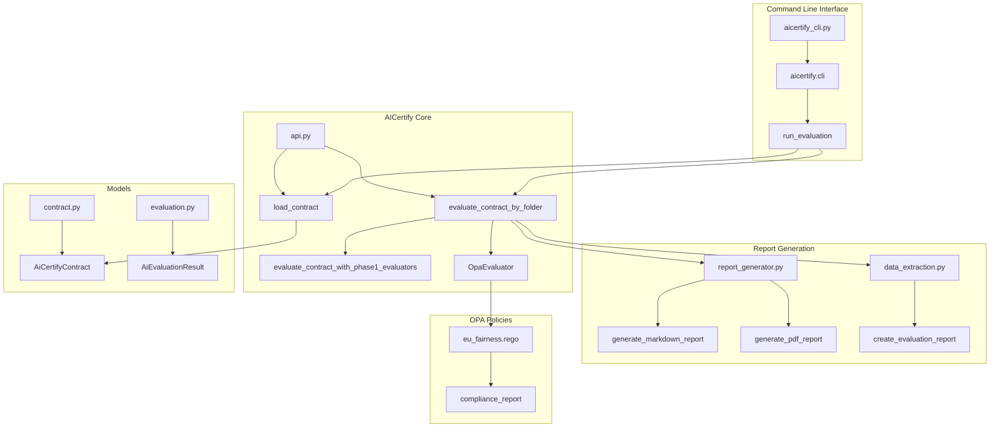

# AICertify CLI Architecture

The following diagram illustrates the architecture of the AICertify CLI tool and how it interacts with the existing AICertify codebase.

## Component Descriptions

### Command Line Interface
- **aicertify_cli.py**: Wrapper script that provides a simple entry point for the CLI
- **aicertify.cli**: Main CLI module that parses arguments and calls the appropriate functions
- **run_evaluation**: Function that orchestrates the evaluation process

### AICertify Core
- **api.py**: Core API module that provides the main functionality
- **load_contract**: Function to load a contract from a JSON file
- **evaluate_contract_by_folder**: Function to evaluate a contract using OPA policies from a specific folder
- **evaluate_contract_with_phase1_evaluators**: Function to evaluate a contract using Phase 1 evaluators
- **OpaEvaluator**: Class that handles OPA policy evaluation

### Report Generation
- **report_generator.py**: Module that generates reports in various formats
- **generate_markdown_report**: Function to generate a Markdown report
- **generate_pdf_report**: Function to generate a PDF report
- **data_extraction.py**: Module that extracts data from evaluation results
- **create_evaluation_report**: Function to create an evaluation report model

### Models
- **contract.py**: Module that defines contract models
- **AiCertifyContract**: Pydantic model for AI contracts
- **evaluation.py**: Module that defines evaluation models
- **AiEvaluationResult**: Pydantic model for evaluation results

### OPA Policies
- **eu_fairness.rego**: OPA policy for EU fairness requirements
- **compliance_report**: Rule that generates a compliance report

## Data Flow

1. The user runs the CLI tool with the required arguments
2. The CLI parses the arguments and calls the `run_evaluation` function
3. `run_evaluation` loads the contract using `load_contract`
4. `run_evaluation` calls `evaluate_contract_by_folder` to evaluate the contract
5. `evaluate_contract_by_folder` calls `evaluate_contract_with_phase1_evaluators` to run Phase 1 evaluators
6. `evaluate_contract_by_folder` uses `OpaEvaluator` to evaluate the contract against OPA policies
7. `evaluate_contract_by_folder` generates a report using the report generation modules
8. The report is saved to the specified output directory
9. A summary of the results is printed to the console
