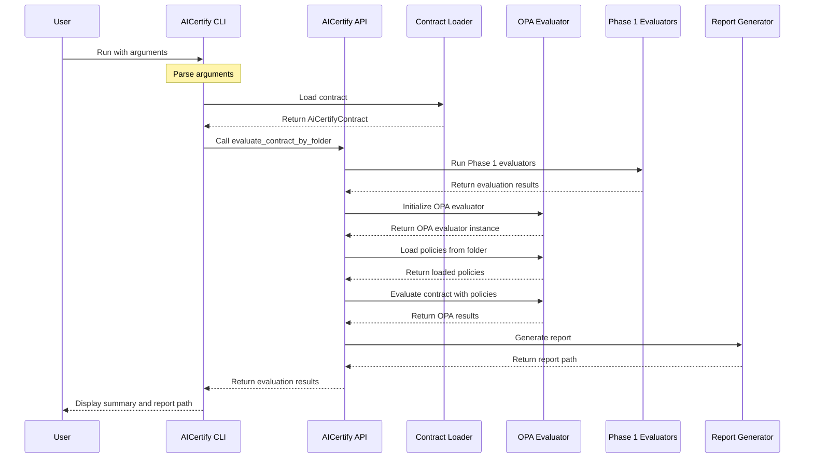

# AICertify CLI Sequence Diagram

The following diagram illustrates the sequence of operations when running the AICertify CLI tool.

## Sequence Description

1. **User Initiates CLI**: The user runs the CLI tool with the required arguments.

2. **Argument Parsing**: The CLI parses the command-line arguments to determine the contract path, policy folder, and other options.

3. **Contract Loading**: The CLI loads the contract from the specified JSON file.

4. **Evaluation Initiation**: The CLI calls the `evaluate_contract_by_folder` function in the AICertify API.

5. **Phase 1 Evaluation**: The API runs Phase 1 evaluators (fairness, content safety, etc.) on the contract.

6. **OPA Evaluator Initialization**: The API initializes the OPA evaluator.

7. **Policy Loading**: The OPA evaluator loads policies from the specified folder.

8. **OPA Evaluation**: The OPA evaluator evaluates the contract against the loaded policies.

9. **Report Generation**: The API generates a report based on the evaluation results.

10. **Results Return**: The API returns the evaluation results to the CLI.

11. **User Feedback**: The CLI displays a summary of the results and the path to the generated report.

This sequence ensures that the contract is properly evaluated against both Phase 1 evaluators and OPA policies, and that the results are presented to the user in a clear and concise manner.
