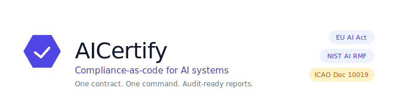
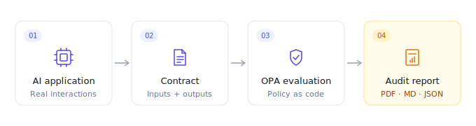
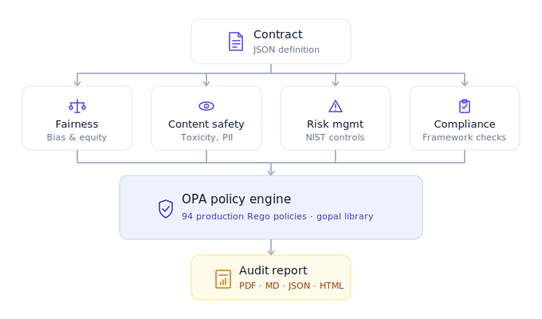
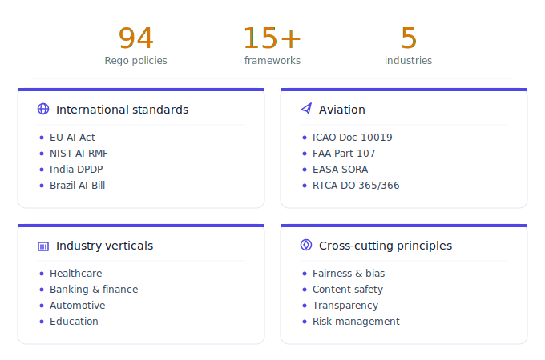
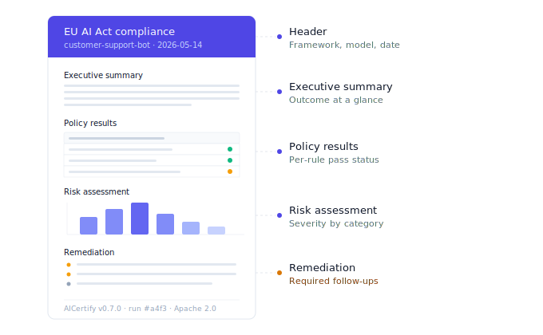

<div align="center">
  <picture>
    <source media="(prefers-color-scheme: dark)" srcset="diagrams/hero_banner_dark.svg">
    
  </picture>
</div>

<p align="center">
  <a href="README.md">English</a> |
  <a href="README.zh-CN.md">简体中文</a> |
  <a href="README.ja-JP.md">日本語</a> |
  <a href="README.ko-KR.md">한국어</a> |
  <strong>हिन्दी</strong>
</p>

<p align="center">
  <em>अपने AI का ऑडिट EU AI Act, NIST AI RMF, और 13 और फ्रेमवर्क्स के विरुद्ध करें — एक कॉन्ट्रैक्ट, एक कमांड, एक रिपोर्ट।</em>
</p>

<p align="center">
  <a href="https://pypi.org/project/aicertify/"></a>
  <a href="https://github.com/Principled-Evolution/aicertify/actions/workflows/aicertify-ci.yaml"></a>
  <a href="https://github.com/Principled-Evolution/aicertify/stargazers"></a>
  <a href="https://www.python.org/"></a>
  <a href="https://opensource.org/licenses/Apache-2.0"></a>
  <a href="https://www.openpolicyagent.org/"></a>
  <a href="https://github.com/Principled-Evolution/gopal"></a>
  <a href="https://makeapullrequest.com"></a>
</p>

<p align="center">
  <picture>
    <source media="(prefers-color-scheme: dark)" srcset="diagrams/diagram1_hero_flow_dark.svg">
     AICertify Contract -> OPA Policy Evaluation -> Compliance Report" width="85%" />
  </picture>
</p>

<br>

रेगुलेटर्स आपके गवर्नेंस डॉक्यूमेंट्स से तेज़ी से आगे बढ़ रहे हैं। EU AI Act लागू हो चुका है। NIST AI RMF अमेरिका का डी-फैक्टो स्टैंडर्ड है। भारत, ब्राज़ील, और सिंगापुर अगले हैं। `AICertify` आपको इन दायित्वों को निष्पादन योग्य [Open Policy Agent](https://www.openpolicyagent.org/) पॉलिसीज़ के रूप में एनकोड करने, कैप्चर की गई AI इंटरैक्शन्स के विरुद्ध चलाने, और PDF, Markdown, JSON, या HTML में ऑडिट-तैयार रिपोर्ट्स तैयार करने की सुविधा देता है।

यह *"हमारे पास एक responsible-AI पॉलिसी है"* और *"हम इसे सिद्ध कर सकते हैं"* के बीच की लुप्त कड़ी है।

---

## Quick Start

```bash
pip install aicertify       # पहली बार इंस्टॉल में लगभग 3–5 मिनट (langchain + transformers डाउनलोड होते हैं)

# OPA बाइनरी एक बार इंस्टॉल करें (~80 MB)
curl -L https://openpolicyagent.org/downloads/latest/opa_linux_amd64 -o /usr/local/bin/opa && sudo chmod +x /usr/local/bin/opa

# बंडल्ड डेमो चलाएँ — कोई कॉन्ट्रैक्ट फ़ाइल नहीं, कोई API key नहीं, ~10 सेकंड
aicertify demo
```

`aicertify demo` एक बंडल्ड सैंपल कॉन्ट्रैक्ट लोड करता है, उसे OPA के माध्यम से EU AI Act पॉलिसी सेट पर मूल्यांकित करता है, और मौजूदा डायरेक्टरी में `aicertify_demo_report.md` लिखता है। रिपोर्ट खोलिए — यही आपके ऑडिट डिलिवरेबल का स्वरूप है।

विस्तृत मूल्यांकन (LangFair फेयरनेस मेट्रिक्स, DeepEval कंटेंट-सेफ़्टी स्कोरिंग, PDF रिपोर्ट) के लिए [`examples/quickstart.py`](examples/quickstart.py) और [फ़ोर्क-योग्य उदाहरण बॉट्स](examples/) देखें — हर उदाहरण में `input_contract.json`, `policy_config.yaml` और `run.py` शामिल हैं।

### डेवलपमेंट के लिए

```bash
git clone https://github.com/Principled-Evolution/aicertify.git
cd aicertify
pip install -e .
```

### न्यूनतम Python उपयोग

```python
from aicertify import regulations, application

# 1. Pick the regulations you want to certify against
regs = regulations.create("my_regulations")
regs.add("eu_ai_act")

# 2. Wrap your AI app
app = application.create(
    name="customer-support-bot",
    model_name="gpt-4o",
    model_version="2024-08-06",
)

# 3. Feed it real interactions
app.add_interaction(
    input_text="I want a refund for my order",
    output_text="I can help with that. Could you share your order number?",
)

# 4. Evaluate and get reports back
await app.evaluate(regulations=regs, report_format="pdf", output_dir="reports")
```

यही पूरा लूप है। **Contract → interactions → evaluate → report.**

---

## AICertify क्यों

अधिकांश AI-गवर्नेंस टूलिंग या तो:

- **एक वेंडर SaaS** है जो आपके ऑडिट ट्रेल को लॉगिन के पीछे बंद रखता है (Credo AI, Holistic AI), या
- **एक रिसर्च टूलकिट** है जो एक ही आयाम पर केंद्रित है — फेयरनेस मेट्रिक्स (Fairlearn, AI Fairness 360) या व्याख्यात्मकता (Microsoft RAI Toolbox)।

दोनों में से कोई भी वह डॉक्यूमेंट तैयार नहीं करता जिसकी रेगुलेटर वास्तव में मांग करता है: *प्रमाण कि आपने इस AI सिस्टम का परीक्षण एक नामित विनियमन के विरुद्ध किया है, पुनरुत्पादनीय पॉलिसीज़ और दिनांकित रिपोर्ट के साथ।*

AICertify उसी आर्टिफैक्ट के लिए बनाया गया है।

| | AICertify | Fairlearn / AIF360 | MS RAI Toolbox | Credo AI |
|---|---|---|---|---|
| ओपन सोर्स | ✅ Apache 2.0 | ✅ MIT | ✅ MIT | ❌ क्लोज़्ड |
| On-prem / air-gapped | ✅ | ✅ | ✅ | ❌ |
| नामित रेगुलेटरी फ्रेमवर्क्स | **EU AI Act, NIST RMF, Brazil AI Bill, India DPDP, +11 और** | ❌ (केवल फेयरनेस) | ❌ (टूलकिट) | ✅ |
| Policy-as-code (ऑडिटेबल, diff-able) | ✅ OPA / Rego | ❌ | ❌ | ❌ |
| बॉक्स से बाहर इंडस्ट्री वर्टिकल्स | Aviation, Banking, Healthcare, Automotive, Education | ❌ | ❌ | आंशिक |
| ऑडिट-तैयार रिपोर्ट्स जनरेट करता है | ✅ PDF / MD / JSON / HTML | ❌ | आंशिक | ✅ |
| कस्टम पॉलिसीज़ | ✅ एक `.rego` फ़ाइल ड्रॉप करें | ❌ | N/A | ✅ (पेड) |

---

## यह कैसे काम करता है

<p align="center">
  <picture>
    <source media="(prefers-color-scheme: dark)" srcset="diagrams/diagram2_architecture_dark.svg">
    
  </picture>
</p>

1. **Contract** — आपके AI एप्लिकेशन का एक JSON विवरण: model, version, कैप्चर की गई interactions, metadata।
2. **Evaluators** — प्लग करने योग्य Python evaluators (Fairness, ContentSafety, RiskManagement, Compliance) आपकी interactions से मेट्रिक्स निकालते हैं।
3. **OPA policies** — मेट्रिक्स का मूल्यांकन विनियमन की Rego पॉलिसीज़ ([gopal](https://github.com/Principled-Evolution/gopal) पॉलिसी लाइब्रेरी से प्राप्त) के विरुद्ध किया जाता है।
4. **Report** — एक फॉर्मेटेड, दिनांकित आर्टिफैक्ट जिसे आप कानूनी टीम, ऑडिटर, या अपनी AI रिस्क कमेटी को सौंप सकते हैं।

चूंकि पॉलिसीज़ डिक्लेरेटिव Rego हैं, वे किसी भी अन्य कोड की तरह वर्ज़न, diff, और रिव्यू होती हैं। जब कोई विनियमन बदलता है, तो आप पॉलिसी अपडेट करते हैं — अपनी मूल्यांकन हार्नेस नहीं।

---

## रेगुलेटरी कवरेज

<p align="center">
  <picture>
    <source media="(prefers-color-scheme: dark)" srcset="diagrams/diagram3_regulatory_coverage_dark.svg">
    
  </picture>
</p>

AICertify [gopal](https://github.com/Principled-Evolution/gopal) पॉलिसी लाइब्रेरी के विरुद्ध चलता है — इन फ्रेमवर्क्स में **94 प्रोडक्शन OPA पॉलिसीज़**:

### अंतर्राष्ट्रीय
- **EU AI Act** — 29 पॉलिसीज़ जो निषिद्ध प्रथाओं, बायोमेट्रिक ID, मैनिपुलेशन, पारदर्शिता, तकनीकी डॉक्यूमेंटेशन, मानवीय निगरानी, GPAI दायित्वों को कवर करती हैं
- **NIST AI RMF** — Govern, Map, Measure, Manage + AI 600-1
- **India Digital Policy** — DPDP-aligned दायित्व
- **Brazil AI Governance Bill** — एल्गोरिदमिक गवर्नेंस आवश्यकताएँ
- **एविएशन स्टैंडर्ड्स** — ICAO Doc 10019, RTCA DO-365/366, ASTM F3442, ISO 21384, FAA Part 107, EASA SORA

### इंडस्ट्री-विशिष्ट
- **Aviation** (17 पॉलिसीज़) — Detect-and-avoid, certification, design, इंटीग्रेशन वैलिडेशन
- **Education** (12 पॉलिसीज़) — FERPA, COPPA, प्रॉक्टरिंग, human-in-the-loop ग्रेडिंग
- **Banking & Financial Services** — मॉडल रिस्क, fair lending
- **Healthcare** — पेशेंट सेफ्टी, डायग्नोस्टिक सेफ्टी
- **Automotive** — व्हीकल सेफ्टी इंटीग्रेशन

### Global & Operational
- **Global** — जवाबदेही, फेयरनेस, पारदर्शिता, व्याख्यात्मकता, कंटेंट सेफ्टी, रिस्क मैनेजमेंट, सिक्योरिटी
- **Corporate** — InfoSec, गवर्नेंस
- **AIOps & Cost** — स्केलेबिलिटी, संसाधन दक्षता

अपना विनियमन यहाँ नहीं देखा? [एक Rego फ़ाइल जोड़ें](https://github.com/Principled-Evolution/gopal/blob/main/CONTRIBUTING.md)। लाइब्रेरी विस्तार के लिए डिज़ाइन की गई है।

---

## CLI

```bash
python -m aicertify.cli \
  --contract path/to/contract.json \
  --policy aicertify/opa_policies/international/eu_ai_act/v1 \
  --report-format pdf \
  --output-dir reports/
```

उपयोगी फ़्लैग्स:

| Flag | उद्देश्य |
|---|---|
| `--contract` | AI एप्लिकेशन कॉन्ट्रैक्ट JSON का पथ |
| `--policy` | जिसके विरुद्ध मूल्यांकन करना है उस OPA पॉलिसी फ़ोल्डर का पथ |
| `--report-format` | `pdf`, `markdown`, `json`, `html` (डिफ़ॉल्ट: `pdf`) |
| `--evaluators` | विशिष्ट evaluators तक सीमित करें (जैसे `Fairness ContentSafety`) |
| `--output-dir` | जहाँ रिपोर्ट्स लैंड होती हैं (डिफ़ॉल्ट: `./reports`) |
| `--verbose` | वर्बोज़ लॉगिंग |

पूर्ण Python API के लिए [`examples/quickstart.py`](examples/quickstart.py) देखें।

---

## सैंपल रिपोर्ट्स

<p align="center">
  <picture>
    <source media="(prefers-color-scheme: dark)" srcset="diagrams/diagram5_report_anatomy_dark.svg">
    
  </picture>
</p>

`examples/outputs/` डायरेक्टरी में वास्तविक मूल्यांकनों से जनरेट की गई रिपोर्ट्स हैं जिन्हें आप कुछ भी चलाने से पहले देख सकते हैं:

- `eu_ai_act/` — EU AI Act के विरुद्ध मूल्यांकन किया गया एक customer-support agent
- `loan_evaluation/` — fair lending के लिए मूल्यांकन किया गया एक credit-scoring मॉडल
- `medical_diagnosis/` — पेशेंट सेफ्टी के लिए मूल्यांकन किया गया एक clinical-decision-support मॉडल

PDFs खोलिए। यही आपका ऑडिटर चाहता है।

---

## स्थिति

AICertify **beta (v0.7.0)** में है — 1.0 रिलीज़ से पहले API विकसित हो सकता है। आज प्रोडक्शन-तैयार फ्रेमवर्क्स:

- ✅ EU AI Act
- ✅ Global evaluators (fairness, content safety, transparency)
- ✅ Healthcare, BFS, Automotive इंडस्ट्री पॉलिसीज़
- ✅ Aviation पॉलिसी सेट (RTCA, ASTM, FAA, EASA)
- 🚧 NIST AI RMF — आंशिक कवरेज
- 🚧 India Digital Policy — प्रारंभिक चरण

[पॉलिसी लाइब्रेरी रोडमैप](https://github.com/Principled-Evolution/gopal) में प्रगति ट्रैक करें।

---

## योगदान

हम स्वागत करते हैं:

- नए रेगुलेटरी फ्रेमवर्क्स (स्कोप संरेखित करने के लिए पहले एक issue खोलें)
- इंडस्ट्री-विशिष्ट पॉलिसीज़ जिन्हें आपने वास्तविक उपयोग में परखा है
- नए evaluators (fairness, safety, robustness — `aicertify/evaluators/` देखें)
- न्यूनतम पुनरुत्पादनीय कॉन्ट्रैक्ट के साथ बग रिपोर्ट्स

[CONTRIBUTING.md](CONTRIBUTING.md) और [Code of Conduct](CODE_OF_CONDUCT.md) से शुरुआत करें।

---

## संबंधित प्रोजेक्ट्स

- **[gopal](https://github.com/Principled-Evolution/gopal)** — वह OPA पॉलिसी लाइब्रेरी जिसका AICertify उपयोग करता है। यदि आपको Python फ्रेमवर्क की आवश्यकता नहीं है तो OPA CLI के साथ स्टैंडअलोन उपयोग करें।
- **[Open Policy Agent](https://www.openpolicyagent.org/)** — पॉलिसी इंजन।
- **[Regal](https://github.com/StyraInc/regal)** — पॉलिसीज़ को साफ़ रखने के लिए उपयोग किया जाने वाला Rego linter।

---

## लाइसेंस

Apache License 2.0 — [LICENSE](LICENSE) देखें।

<p align="center"><sub><a href="https://github.com/Principled-Evolution">Principled Evolution</a> द्वारा निर्मित · पॉलिसीज़ जिन्हें आप पढ़ सकते हैं, चला सकते हैं, और सिद्ध कर सकते हैं।</sub></p>
