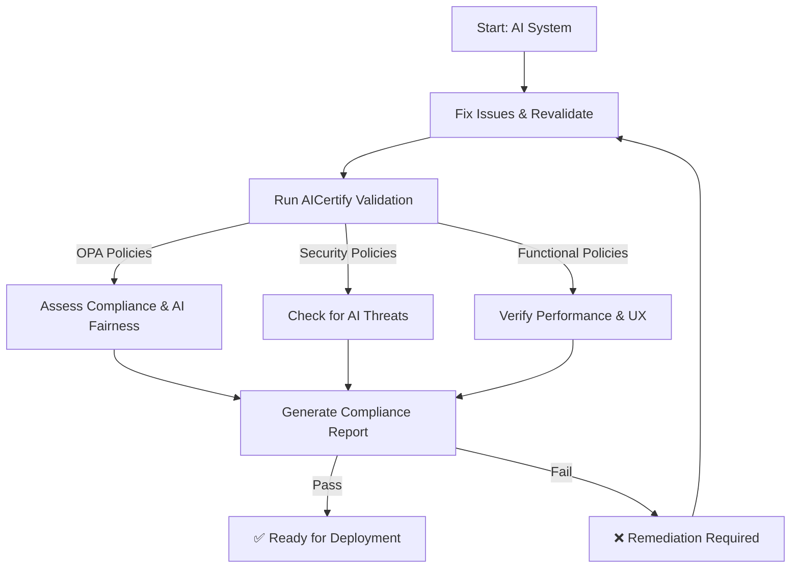
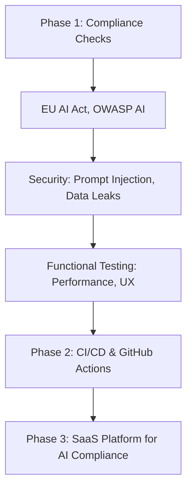

# **AICertify - AI Self-Certification Framework 🚀**  
[](https://github.com/mantric/AICertify/actions/workflows/aicertify-ci.yml)  
[](https://github.com/mantric/AICertify/discussions)  
[](https://github.com/mantric/AICertify/blob/main/LICENSE)  
[](https://github.com/mantric/AICertify/issues)  

### **📌 Overview**
**AICertify** helps businesses, compliance teams, and developers **self-certify AI applications** against **regulatory, security, and functional** policies using **Open Policy Agent (OPA)**. It ensures AI applications comply with:
- ✅ **Regulatory Standards** (e.g., **EU AI Act, OWASP AI Security**).
- ✅ **AI Fairness & Bias Detection** (via **LangFair** integration).
- ✅ **Security & Risk Mitigation** (e.g., **Prompt Injection, Data Exfiltration**).
- ✅ **Functional Validation & Acceptance Criteria** (Performance, Accuracy).

---

## **📌 Who Should Use AICertify?**
| 👩‍⚖️ **Compliance Teams** | 🏢 **Business Leaders** | 👨‍💻 **Developers** |
|------------------|------------------|------------------|
| ✅ Ensure AI meets **regulatory standards**. | ✅ Verify **trustworthiness** of AI applications. | ✅ Automate **AI validation** via CI/CD. |
| ✅ Assess **bias, fairness, and transparency**. | ✅ Reduce **legal & reputational risks**. | ✅ Validate **security, performance, and explainability**. |
| ✅ Maintain an **audit trail of AI compliance**. | ✅ Improve **customer trust** & adoption. | ✅ Get structured feedback on AI models. |

---

## **📌 AICertify Process Overview**


### **🎯 How AICertify Works**
1. **AI Model, API, or Application Outputs Data**.
2. **AICertify evaluates it** against **predefined policies**.
3. **Validation Categories**:
   - **Regulatory Compliance**: EU AI Act, OWASP AI.
   - **Security Risks**: Injection, Data Leaks.
   - **Functional Criteria**: Latency, Explainability.
4. **Results**:
   - ✅ **Pass** → AI is **ready for deployment**.
   - ❌ **Fail** → Developers get **detailed issue reports**.

---

## **📌 Installation**
### **🔧 1️⃣ Install Open Policy Agent (OPA)**
```bash
curl -L -o opa https://openpolicyagent.org/downloads/latest/opa_linux_amd64
chmod +x opa
sudo mv opa /usr/local/bin/
```
Verify installation:
```bash
opa version
```

### **🐍 2️⃣ Install Python Dependencies**
```bash
git clone https://github.com/mantric/AICertify.git
cd AICertify
pip install -r requirements.txt
```

---

## **📌 Usage**
### **1️⃣ Validate an AI Application via CLI**
```bash
python cli.py --category compliance/eu_ai_act --input examples/input_examples.json
```

### **2️⃣ Run AICertify as an API Service**
```bash
uvicorn service:app --reload
```

### **3️⃣ Test API with a Request**
```bash
curl -X POST "http://localhost:8000/validate" -H "Content-Type: application/json" -d '{"category": "compliance/eu_ai_act", "input_data": {"bias_score": 0.03}}'
```

---

## **📌 Example Policies**
### **📜 Fairness & Bias Detection (`fairness.rego`)**
```rego
package compliance.eu_ai_act

default allow = false

allow {
    input.bias_score < 0.05
}
```
**Test Input (`input_examples.json`)**:
```json
{
    "bias_score": 0.03
}
```
**Run Test**:
```bash
python cli.py --category compliance/eu_ai_act --input examples/input_examples.json
```

---

## **📌 Roadmap**


### **✔ Current Progress**
✅ **Phase 1: OPA-based Compliance Checks**  
✅ **Phase 2: CI/CD Integration with GitHub Actions**  
⬜ **Phase 3: LangFair Bias Detection**  
⬜ **Phase 4: AI Security & Performance Monitoring**  

---

## **📌 Contributing**
We welcome **developers, AI researchers, and governance professionals**! 🎉  
Follow our **[Contribution Guide](CONTRIBUTING.md)**.

### **🛠️ Quick Contribution Guide**
1. **Fork & Clone Repo**
   ```bash
   git clone https://github.com/mantric/AICertify.git
   cd AICertify
   ```
2. **Create a Feature Branch**
   ```bash
   git checkout -b feature-new-policy
   ```
3. **Test Changes**
   ```bash
   python cli.py --category compliance/eu_ai_act --input examples/input_examples.json
   ```
4. **Submit a Pull Request (PR)**.

---

## **📌 Community & Support**
👥 **Join the Discussion!**  
[](https://github.com/mantric/AICertify/discussions)

🔔 **Stay Updated on Roadmap & Announcements**  
**[GitHub Discussions](https://github.com/mantric/AICertify/discussions)**  

🐞 **Found a Bug?**  
[Open a GitHub Issue](https://github.com/mantric/AICertify/issues)  

📜 **Follow Our [Code of Conduct](CODE_OF_CONDUCT.md)**  

---

## **📜 License**
This project is licensed under the **Apache 2.0 License**.  
See [LICENSE](LICENSE) for details.
