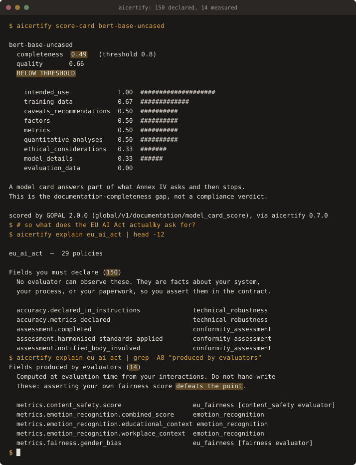

<div align="center">
  <picture>
    <source media="(prefers-color-scheme: dark)" srcset="diagrams/hero_banner_dark.svg">
    
  </picture>
</div>

<p align="center">
  <a href="README.md">English</a> |
  <a href="README.zh-CN.md">简体中文</a> |
  <a href="README.ja-JP.md">日本語</a> |
  <a href="README.ko-KR.md">한국어</a> |
  <a href="README.hi-IN.md">हिन्दी</a>
</p>

<p align="center">
  <em>Open-source compliance-as-code for AI systems: one contract, executable OPA/Rego policies, and reproducible evidence across the EU AI Act, UK AI governance, NIST AI RMF, and more.</em>
</p>

<p align="center">
  <a href="https://pypi.org/project/aicertify/"></a>
  <a href="https://github.com/Principled-Evolution/aicertify/actions/workflows/aicertify-ci.yaml"></a>
  <a href="https://github.com/Principled-Evolution/aicertify/stargazers"></a>
  <a href="https://www.python.org/"></a>
  <a href="https://opensource.org/licenses/Apache-2.0"></a>
  <a href="https://www.openpolicyagent.org/ecosystem/entry/principled-evolution"></a>
  <a href="https://github.com/Principled-Evolution/gopal"></a>
  <a href="https://makeapullrequest.com"></a>
</p>

<p align="center">
  <picture>
    <source media="(prefers-color-scheme: dark)" srcset="diagrams/diagram1_hero_flow_dark.svg">
     AICertify Contract -> OPA Policy Evaluation -> Compliance Report" width="85%" />
  </picture>
</p>

<br>

<p align="center">
  
</p>

<p align="center">
  <sub>Scoring a real Hugging Face card, then asking what the EU AI Act actually needs.<br>
  <a href="https://principledevolution.ai/aicertify">Watch the full four-minute walkthrough</a>, including running a contract and the metrics still missing an evaluator.</sub>
</p>

<br>

**AICertify is the open execution and evidence layer for AI governance.** Describe an AI system in a contract, supply the facts only your organisation can know, attach or compute measured metrics, evaluate that evidence against versioned [GOPAL](https://github.com/Principled-Evolution/gopal) policies through [Open Policy Agent](https://www.openpolicyagent.org/), and generate dated PDF, Markdown, JSON, or HTML reports.

**The goal is simple: move from “we have an AI policy” to evidence another engineer, auditor, or risk team can inspect and reproduce.**

**Use AICertify to:**

- evaluate an AI system against named governance and regulatory policy sets, including the EU AI Act, UK AI governance, NIST AI RMF, fair lending, education, healthcare, and aviation
- keep organisation-declared facts distinct from evaluator-produced measurements
- run the same inspectable OPA/Rego policy logic locally, in CI/CD, or in an air-gapped environment
- generate portable PDF, Markdown, JSON, or HTML evidence with per-policy results
- extend the stack with your own Rego policies and evaluator adapters ([GitHub Actions guide](docs/integrations/github-actions.md))

AICertify is part of the [Open Policy Agent ecosystem](https://www.openpolicyagent.org/ecosystem/entry/principled-evolution), using the same policy engine widely used for Kubernetes admission, service authorisation, and infrastructure policy.

> ⭐ **Building AI governance as code? Star AICertify so other engineers, auditors, and policy-as-code practitioners can find it.**

<p align="center">
  <b>Jump to:</b>
  <a href="#quick-start">Run the demo</a> &middot;
  <a href="#why-aicertify">Why AICertify</a> &middot;
  <a href="#regulatory-coverage">Coverage</a> &middot;
  <a href="#see-the-output">See a report</a> &middot;
  <a href="#contributing">Contribute</a>
</p>

---

## Quick Start

```bash
# 1. Install AICertify (~3–5 min on first install; pulls langchain + transformers)
pip install aicertify

# 2. Install the OPA binary, one-time (~80 MB)
curl -L https://openpolicyagent.org/downloads/latest/opa_linux_amd64 -o /usr/local/bin/opa && sudo chmod +x /usr/local/bin/opa

# 3. Run the bundled demo (no contract file, no API keys)
aicertify demo
```

`aicertify demo` loads a bundled sample contract, evaluates it against the EU AI Act policy set via OPA, and writes `aicertify_demo_report.md` to the current directory. Open the report to inspect the actual output format before integrating AICertify.

> **The bundled demo intentionally fails closed.** Its contract contains no compliance declarations, so policies that require that evidence deny. Most runtime is evaluator-stack import, including torch and transformers. No API keys are used, even if `OPENAI_API_KEY` is set; pass `--with-llm-metrics` to opt in to LLM-judged fairness and toxicity scoring, which can incur model/API cost and takes longer.
>
> If you only need policy verdicts without the evaluator stack, the [gopal](https://github.com/Principled-Evolution/gopal) bundles run directly with the `opa` binary.

<p align="center">
  
</p>

For richer evaluations (LangFair fairness metrics, DeepEval content-safety scoring, PDF reports), see [`examples/quickstart.py`](examples/quickstart.py) and the [forkable example bots](examples/), each of which ships an `input_contract.json`, a `policy_config.yaml`, and a `run.py`.

### Finding out what a framework needs

The first integration question is what the selected policies actually read. The EU AI Act policy set needs 155 distinct input fields; `aicertify explain` and `aicertify init-contract` expose them before evaluation rather than requiring you to infer them from failures.

`aicertify explain` lists every field a framework's policies read, split by who is
supposed to supply it:

```bash
aicertify explain uk
```

```
uk  —  6 policies

Fields you must declare (31)
  No evaluator can observe these. They are facts about your system,
  your process, or your paperwork, so you assert them in the contract.

  decision.article_9_condition                   automated_decision_making
  decision.meaningful_human_involvement          automated_decision_making
  ...
  governance.oversight_body_in_place             accountability_governance
  safeguards.human_intervention_available        automated_decision_making
```

Nothing in a transcript reveals whether a conformity assessment was completed or
whether a human can intervene in an automated decision, so those are declarations.
Fairness and toxicity scores are the opposite: the evaluators compute them, and the
command marks them as such so you do not hand-write your own results.

`aicertify init-contract` turns that list into a file to fill in, nested into the shape
the policies actually read:

```bash
aicertify init-contract --policy uk > contract.json
```

```json
{
  "application_name": "your-application",
  "model_info": { "model_name": "your-model", "model_version": "v1", "metadata": {} },
  "interactions": [ { "input_text": "Replace with a real prompt from your system.", "…": "…" } ],
  "context": {
    "decision": { "significant": null, "special_category_data_involved": null },
    "governance": { "accountable_person_named": null, "oversight_body_in_place": null },
    "safeguards": { "human_intervention_available": null, "information_provided": null }
  }
}
```

Replace the nulls and run `aicertify evaluate --contract contract.json --policy uk`.
A field left as `null` is dropped rather than sent as an explicit null, so an
unfilled scaffold denies instead of being read as "assessed, and false".

Add `--policies` to see the individual policies, or `--json` for machine-readable
output. `aicertify explain <framework>` with no valid match prints the list of
frameworks it accepts.

### For development

```bash
git clone https://github.com/Principled-Evolution/aicertify.git
cd aicertify
pip install -e .
```

### Minimal Python usage

```python
from aicertify import regulations, application

# 1. Pick the regulations you want to certify against
regs = regulations.create("my_regulations")
regs.add("eu_ai_act")

# 2. Wrap your AI app
app = application.create(
    name="customer-support-bot",
    model_name="gpt-4o",
    model_version="2024-08-06",
)

# 3. Feed it real interactions
app.add_interaction(
    input_text="I want a refund for my order",
    output_text="I can help with that. Could you share your order number?",
)

# 4. Evaluate and get reports back
await app.evaluate(regulations=regs, report_format="pdf", output_dir="reports")
```

That's the whole loop. **Contract → evidence → policy evaluation → report.**

---

## Why AICertify

Evaluation libraries such as Fairlearn and AI Fairness 360 are designed to measure specific properties. Governance platforms address broader inventory, workflow, and assurance-management needs. **AICertify addresses the open execution layer between them:** it combines declared system facts with measured evidence, runs inspectable GOPAL/Rego policies through OPA, and emits portable, dated results.

The differentiator is reproducibility. You can inspect the policy logic, pin versions, run locally or air-gapped, review changes in Git, and retain the resulting evidence outside a vendor account.

| | AICertify | Fairlearn / AIF360 | MS RAI Toolbox | Governance SaaS |
|---|---|---|---|---|
| Open source | ✅ Apache 2.0 | ✅ MIT | ✅ MIT | Varies |
| Local / air-gapped execution | ✅ | ✅ | ✅ | Varies |
| Named governance / regulatory policy sets | ✅ via GOPAL | ❌ (measurement library) | ❌ (toolkit) | Common |
| Inspectable policy-as-code | ✅ OPA / Rego | ❌ | ❌ | Varies |
| Industry-specific policy coverage | ✅ | ❌ | ❌ | Varies |
| Portable dated reports | ✅ PDF / MD / JSON / HTML | ❌ | Partial | Common |
| Custom policy logic | ✅ Rego | ❌ | N/A | Product-specific |

---

## How It Works

<p align="center">
  <picture>
    <source media="(prefers-color-scheme: dark)" srcset="diagrams/diagram2_architecture_dark.svg">
    
  </picture>
</p>

1. **Contract**: identifies the AI application and carries captured interactions plus the declared facts supplied by the organisation.
2. **Evaluators and adapters**: produce measured metrics or map outputs from tools you already run onto the canonical fields GOPAL reads.
3. **Policy evaluation**: OPA evaluates the combined declarations and measurements against versioned [gopal](https://github.com/Principled-Evolution/gopal) Rego policies.
4. **Report**: emits a dated PDF, Markdown, JSON, or HTML artifact with the resulting policy evaluations.

AICertify keeps evidence production separate from policy semantics: evaluators and adapters supply evidence, GOPAL defines the rules, and OPA produces the verdicts. That separation makes both evidence mappings and policy changes independently reviewable.

---

## Regulatory Coverage

<p align="center">
  <picture>
    <source media="(prefers-color-scheme: dark)" srcset="diagrams/diagram3_regulatory_coverage_dark.svg">
    
  </picture>
</p>

AICertify runs against the [gopal](https://github.com/Principled-Evolution/gopal) 2.0.0 policy library: **92 executable OPA policies** across these frameworks:

### International
- **EU AI Act** (29 policies): prohibited practices, biometric ID, manipulation, transparency, technical documentation, human oversight, GPAI obligations, conformity assessment and CE marking. Every obligation area is implemented; see [gopal's coverage matrix](https://github.com/Principled-Evolution/gopal/blob/main/docs/coverage/eu-ai-act.md) for the article-by-article mapping.
- **UK AI framework** (6 policies): the five pro-innovation principles, plus UK GDPR Articles 22A-22D as substituted by section 80 of the Data (Use and Access) Act 2025. The UK and EU automated-decision regimes have diverged, and both are encoded
- **NIST AI RMF** (5 policies): Govern, Map, Measure, Manage + AI 600-1
- **India Digital Policy**: aligned with NITI Aayog's National Strategy for Artificial Intelligence (the separate India DPDP Act isn't covered yet)
- **Brazil AI Governance Bill**: algorithmic governance requirements
- **Aviation standards** (7 policies): ICAO Doc 10019, FAA Part 107, FAA Remote ID, EASA Regulation 2019/947, EASA SORA, RTCA DO-365, ISO 21384

### Industry-specific
- **Aviation** (12 policies): airworthiness, autonomous systems, data management, flight operations
- **Education** (12 policies): FERPA, COPPA, proctoring, human-in-the-loop grading
- **Banking & Financial Services** (4 policies): model risk (SR 11-7, OCC 2011-12, BCBS 239), fair lending, PRA SS1/23, FCA Consumer Duty
- **Legal services** (3 policies): citation verification, client confidentiality, competence and supervision, following the SRA and BSB guidance on AI use
- **Healthcare** (2 policies): patient safety, diagnostic safety
- **Automotive**: vehicle safety integration

### Global & Operational
- **Global**: accountability, fairness, transparency, explainability, content safety, risk management, security
- **Corporate**: InfoSec, governance
- **AIOps & Cost**: scalability, resource efficiency

No category is a scaffold any more. Every policy checks concrete input fields, has a sibling test, and is asserted to deny an input carrying no evidence. `docs/coverage/coverage.json` in gopal is generated from the policy files and records, per policy, the fields it requires and whether it has that test.

Don't see your regulation? [Add a Rego file](https://github.com/Principled-Evolution/gopal/blob/main/CONTRIBUTING.md). The library is designed to be extended.

---

## CLI

```bash
aicertify evaluate \
  --contract path/to/contract.json \
  --policy eu_ai_act \
  --report-format pdf \
  --output-dir reports/
```

Useful flags:

| Flag | Purpose |
|---|---|
| `--contract` | Path to the AI application contract JSON |
| `--policy` | Framework name or path to an OPA policy folder |
| `--report-format` | `pdf`, `markdown`, `json`, `html` (default: `pdf`) |
| `--output-dir` | Where reports land (default: `./reports`) |
| `--verbose` | Verbose logging |

See [`examples/quickstart.py`](examples/quickstart.py) for the full Python API.

---

## See the output

You don't have to install anything to see what AICertify produces. Pre-generated reports are committed to the repo:

- **[demo-report-eu-ai-act.pdf](docs/demo-report-eu-ai-act.pdf)**: a customer-support agent evaluated against the EU AI Act
- **[report_Loan_Application_20250226_212152.pdf](examples/outputs/loan_evaluation/report_Loan_Application_20250226_212152.pdf)**: a credit-scoring model evaluated for fair lending, with the [contract](examples/outputs/loan_evaluation/contract_2025-02-26_212149.json) that produced it
- **[healthcare-triage-bot/expected_report.md](examples/healthcare-triage-bot/expected_report.md)**: a clinical-decision-support model evaluated for patient safety
- **[hiring-screening-bot/expected_report.md](examples/hiring-screening-bot/expected_report.md)**: a hiring model evaluated for bias
- **[customer-support-bot/expected_report.md](examples/customer-support-bot/expected_report.md)**: the Markdown form of the demo report above

<p align="center">
  <picture>
    <source media="(prefers-color-scheme: dark)" srcset="diagrams/diagram5_report_anatomy_dark.svg">
    
  </picture>
</p>

Open the PDFs to inspect the actual deliverable before installing AICertify.

---

## Status

AICertify is in **beta (v0.8.0)**. The API may evolve before the 1.0 release. All bundled GOPAL policies are executable; the important distinction is **the depth of evidence behind each check**:

- ✅ **Threshold checks against measured values.** Global fairness/content-safety/toxicity checks, EU AI Act fairness, healthcare diagnostic safety, and BFS fair lending/model risk compare evaluator-produced measurements against explicit thresholds.
- ✅ **Structural checks against supplied artifacts.** EU AI Act, aviation, automotive, education, and legal policies validate fields extracted or declared from the documentation and evidence supplied to the contract.
- ⚠️ **Declared facts.** NIST AI RMF Map/Measure/Manage, the UK principles, and operational policies include assertions that an evaluator cannot independently infer, such as `input.map.intended_use_documented`. AICertify records and evaluates those assertions; it does not convert them into independent verification.

GOPAL's generated coverage metadata makes this distinction inspectable: policies reading `metrics.*` depend on measured inputs, while declaration paths identify facts supplied by the organisation.

---

## For OPA / Rego users

If you already use OPA for Kubernetes admission, microservice authorisation, or infrastructure governance, AICertify is the AI-system slot in your existing policy strategy.

- **Bring your own Rego policies.** Drop a `.rego` file into the policy folder and it evaluates alongside the bundled set.
- **Evaluate AI interactions through OPA.** Captured inputs, outputs, declarations, and metrics flow into policies via the standard OPA `input` document.
- **Generate portable evidence.** PDF / Markdown / JSON / HTML, one command.
- **Use [gopal](https://github.com/Principled-Evolution/gopal) as the policy library underneath.** 92 executable Rego policies cover the EU AI Act, UK AI governance, NIST AI RMF, aviation safety, FERPA/COPPA, fair lending, UK financial services, legal practice, and more.

AICertify is listed in the [Open Policy Agent ecosystem](https://www.openpolicyagent.org/ecosystem/entry/principled-evolution) as the AI-governance entry alongside Gopal.

---

## What makes an AICertify result reproducible

AICertify does not ask you to trust a proprietary compliance score. A result can be traced through four layers:

1. **System evidence** — the contract identifies the application, model/version, interactions, and organisation-supplied facts.
2. **Measurements** — evaluators and adapters publish the metrics they actually produced under canonical GOPAL field names.
3. **Policy** — the applicable governance logic is readable, versioned Rego from GOPAL.
4. **Evaluation** — OPA produces the policy verdicts, which AICertify packages into a dated report.

The objective is evidence that can be **read, rerun, reviewed, and repeated**—not a claim that the software replaces legal judgment, regulatory conformity assessment, or independent assurance.

See the full positioning in [docs/why-aicertify.md](docs/why-aicertify.md).

---

## Who should contribute?

AICertify is especially useful for:

- **AI engineers** building regulated AI systems
- **Governance, risk, and compliance (GRC) teams** producing audit evidence
- **Auditors and model risk professionals** evaluating third-party AI
- **OPA / Rego users** interested in AI-specific policy authoring
- **Responsible AI researchers** wanting reproducible benchmarks
- **Python developers** interested in compliance automation

**Non-code contributions are welcome:** examples, policy mappings, docs, tests, report templates, and regulatory notes.

A good place to start is the [`good first issue`](https://github.com/Principled-Evolution/aicertify/issues?q=is%3Aissue+is%3Aopen+label%3A%22good+first+issue%22) and [`help wanted`](https://github.com/Principled-Evolution/aicertify/issues?q=is%3Aissue+is%3Aopen+label%3A%22help+wanted%22) labels.

---

## Contributing

We welcome:

- New regulatory frameworks (open an issue first to align scope)
- Industry-specific policies you've battle-tested
- New evaluators (fairness, safety, robustness, see `aicertify/evaluators/`)
- Bug reports with a minimal reproducing contract
- Documentation, examples, and tutorials

Start with [CONTRIBUTING.md](CONTRIBUTING.md), the [Code of Conduct](CODE_OF_CONDUCT.md), and the open [contributor issues](https://github.com/Principled-Evolution/aicertify/issues?q=is%3Aissue+is%3Aopen+label%3A%22good+first+issue%22).

For security issues, please follow the [Security Policy](SECURITY.md): report privately to [security@principledevolution.ai](mailto:security@principledevolution.ai), not via public issue.

---

## Related Projects

- **[gopal](https://github.com/Principled-Evolution/gopal)**: the OPA policy library AICertify uses under the hood. Use it standalone with the OPA CLI if you don't need the Python framework.
- **[Open Policy Agent](https://www.openpolicyagent.org/)**: the policy engine.
- **[Regal](https://github.com/open-policy-agent/regal)**: Rego linter used to keep policies clean.

---

## License

Apache License 2.0, see [LICENSE](LICENSE).

---

<p align="center">
  <strong>⭐ If AICertify is useful to you, please star the repo and share it with one colleague.</strong><br>
  <sub>Every star helps AI governance and policy-as-code practitioners discover the project.</sub>
</p>

<p align="center"><sub>Built by <a href="https://github.com/Principled-Evolution">Principled Evolution</a> · Policies you can read, run, and prove.</sub></p>
