# **AICertify - AI Self-Certification Framework 🚀**  
[](https://github.com/mantric/AICertify/actions/workflows/aicertify-ci.yaml)  
[](https://github.com/mantric/AICertify/discussions)  
[](https://github.com/mantric/AICertify/blob/main/LICENSE)  
[](https://github.com/mantric/AICertify/issues)  

### **📌 Overview**
**AICertify** helps businesses, compliance teams, and developers **self-certify AI applications** against **regulatory, security, and functional** policies using **Open Policy Agent (OPA)**. It ensures AI applications comply with:
- ✅ **Regulatory Standards** (e.g., **EU AI Act, OWASP AI Security**).
- ✅ **AI Fairness & Bias Detection** (via **LangFair** integration).
- ✅ **Security & Risk Mitigation** (e.g., **Prompt Injection, Data Exfiltration**).
- ✅ **Functional Validation & Acceptance Criteria** (Performance, Accuracy).

---

## **📌 Disclaimer (Detailed)**
This software and any reports generated by it are provided under the [Apache License, Version 2.0](https://www.apache.org/licenses/LICENSE-2.0) on an "AS IS" basis, without any warranties or conditions of any kind.  
- **No Guarantee:** The results, analysis, and recommendations do not constitute legal advice or compliance certification.  
- **User Responsibility:** It is the responsibility of the user to verify and implement any recommendations and ensure compliance with all applicable laws and regulations.  
- **Professional Advice:** Always consult a qualified attorney or compliance specialist before making decisions based on report outputs.
  
The above disclaimer is embedded within every generated PDF (as a full disclaimer page and footer) and is included in all software documentation.  

---

## **📌 Who Should Use AICertify?**
| 👩‍⚖️ **Compliance Teams** | 🏢 **Business Leaders** | 👨‍💻 **Developers** |
|------------------|------------------|------------------|
| ✅ Ensure AI meets **regulatory standards**. | ✅ Verify **trustworthiness** of AI applications. | ✅ Automate **AI validation** via CI/CD. |
| ✅ Assess **bias, fairness, and transparency**. | ✅ Reduce **legal & reputational risks**. | ✅ Validate **security, performance, and explainability**. |
| ✅ Maintain an **audit trail of AI compliance**. | ✅ Improve **customer trust** & adoption. | ✅ Get structured feedback on AI models. |

---

## **📌 AICertify Process Overview**

```mermaid
graph TD
    A[Start: AI System] --> B[AI System Outputs & APIs]
    B --> C[Run AICertify Validation]
    C -->|OPA Policies| D[Assess Compliance & AI Fairness]
    C -->|Security Policies| E[Check for AI Threats]
    C -->|Functional Policies| F[Verify Performance & UX]
    D --> G[Generate Compliance Report]
    E --> G
    F --> G
    G -->|Pass| H[✅ Ready for Deployment]
    G -->|Fail| I[❌ Remediation Required]
    I --> B[Fix Issues & Revalidate]
```


### **🎯 How AICertify Works**
1. **AI Model, API, or Application Outputs Data**.
2. **AICertify evaluates it** against **predefined policies**.
3. **Validation Categories**:
   - **Regulatory Compliance**: EU AI Act, OWASP AI.
   - **Security Risks**: Injection, Data Leaks.
   - **Functional Criteria**: Latency, Explainability.
4. **Results**:
   - ✅ **Pass** → AI is **ready for deployment**.
   - ❌ **Fail** → Developers get **detailed issue reports**.

---

## **📌 Installation**
### **🔧 1️⃣ Install Open Policy Agent (OPA)**
**Linux/macOS:**
```bash
curl -L -o opa https://openpolicyagent.org/downloads/latest/opa_linux_amd64
chmod +x opa
sudo mv opa /usr/local/bin/
```

**Windows:**
```powershell
# Create directory for OPA
mkdir C:\opa
cd C:\opa

# Download OPA
Invoke-WebRequest -Uri "https://openpolicyagent.org/downloads/latest/opa_windows_amd64.exe" -OutFile "opa.exe"

# Add to PATH
[Environment]::SetEnvironmentVariable("Path", "$env:Path;C:\opa", "Machine")
```

Verify installation:
```bash
opa version
```

### **🐍 2️⃣ Install Python Dependencies with Poetry**
```bash
git clone https://github.com/mantric/AICertify.git
cd AICertify
poetry install --no-root  # Install dependencies without packaging
```

### **⚡ 3️⃣ Quick Start**
```bash
# Run validation CLI using Poetry:
poetry run python cli.py eval-policy --category compliance/eu_ai_act --input examples/input_examples.json

# To perform folder evaluation:
poetry run python cli.py eval-folder --app-name "CareerCoachAI" --folder examples/pydanticai/contracts --output examples/pydanticai/eval_outputs/

# To run the complete evaluation pipeline (consolidated evaluation + OPA policy validation):
poetry run python cli.py eval-all --app-name "CareerCoachAI Interactive Session" --folder examples/pydanticai/contracts --output consolidated_eval.json --category compliance/fairness

# Start API service
poetry run uvicorn service:app --reload
```

---

## **📌 Usage**
### **1️⃣ Validate an AI Application via CLI**
```bash
poetry run python cli.py eval-policy --category compliance/eu_ai_act --input examples/input_examples.json
```

### **2️⃣ Run AICertify as an API Service**
```bash
poetry run uvicorn service:app --reload
```

### **3️⃣ Test API with a Request**
```bash
curl -X POST "http://localhost:8000/validate" -H "Content-Type: application/json" -d '{"category": "compliance/eu_ai_act", "input_data": {"bias_score": 0.03}}'
```

### **4️⃣ Combined Evaluation via CLI (eval-all)**
This subcommand runs the consolidated evaluation on a folder of contracts and then applies OPA policy evaluation on the consolidated output.
```bash
poetry run python cli.py eval-all --app-name "CareerCoachAI Interactive Session" --folder examples/pydanticai/contracts --output consolidated_eval.json --category compliance/fairness
```

### **5️⃣ Generate Detailed Reports**
During evaluation, you can generate detailed reports in Markdown or PDF format by including additional command-line options:
- To generate a Markdown report, add the flag `--report_md <output_markdown_path>`.
- To generate a PDF report, add the flag `--report_pdf <output_pdf_path>`.

For example:
```bash
poetry run python cli.py eval-all --app-name "CareerCoachAI Interactive Session" --folder examples/pydanticai/contracts --output consolidated_eval.json --category compliance/fairness --report_md report.md --report_pdf report.pdf
```
The generated PDF report will have a timestamp appended to its file name and includes:
- A full disclaimer page on page 2 with detailed disclaimer text.
- A concise footer disclaimer on all other pages.

The Markdown report will correctly render bold text by converting `**text**` into styled bold text.

---

## **📌 Example Policies**
### **📜 Fairness & Bias Detection (`fairness.rego`)**
```rego
package compliance.eu_ai_act

default allow = false

allow {
    input.bias_score < 0.05
}
```
**Test Input (`input_examples.json`)**:
```json
{
    "bias_score": 0.03
}
```
**Run Test**:
```bash
poetry run python cli.py eval-policy --category compliance/eu_ai_act --input examples/input_examples.json
```

---

## **📌 Roadmap**


### **✔ Current Progress**
✅ **Phase 1: OPA-based Compliance Checks**  
✅ **Phase 2: CI/CD Integration with GitHub Actions**  
⬜ **Phase 3: LangFair Bias Detection**  
⬜ **Phase 4: AI Security & Performance Monitoring**  

---

## **📌 Contributing**
We welcome **developers, AI researchers, and governance professionals**! 🎉  
Follow our **[Contribution Guide](CONTRIBUTING.md)**.

### **🛠️ Quick Contribution Guide**
1. **Fork & Clone Repo**
   ```bash
   git clone https://github.com/mantric/AICertify.git
   cd AICertify
   ```
2. **Create a Feature Branch**
   ```bash
   git checkout -b feature-new-policy
   ```
3. **Test Changes**
   ```bash
   poetry run python cli.py eval-policy --category compliance/eu_ai_act --input examples/input_examples.json
   ```
4. **Submit a Pull Request (PR)**.

---

## **📌 Community & Support**
👥 **Join the Discussion!**  
[](https://github.com/mantric/AICertify/discussions)

🔔 **Stay Updated on Roadmap & Announcements**  
**[GitHub Discussions](https://github.com/mantric/AICertify/discussions)**  

🐞 **Found a Bug?**  
[Open a GitHub Issue](https://github.com/mantric/AICertify/issues)  

📜 **Follow Our [Code of Conduct](CODE_OF_CONDUCT.md)**  

---

## **📌 License**
See below or in the [LICENSE](LICENSE) file.

## Prerequisites

### Installing OPA
This tool requires the Open Policy Agent (OPA) executable to be installed and available in your system PATH.

1. Download OPA:
   - Linux/macOS: `curl -L -o opa https://openpolicyagent.org/downloads/latest/opa_linux_amd64`
   - Windows: Download from https://openpolicyagent.org/downloads/latest/opa_windows_amd64.exe

2. Make the OPA executable:
   - Linux/macOS: `chmod 755 ./opa`
   - Windows: Rename the downloaded file to `opa.exe`

3. Move the OPA executable to a directory in your PATH:
   - Linux/macOS: `sudo mv opa /usr/local/bin`
   - Windows: Move `opa.exe` to a directory in your PATH or add its location to PATH

4. Verify installation:
   ```bash
   opa version
   ```

If you see the OPA version number, the installation was successful.
