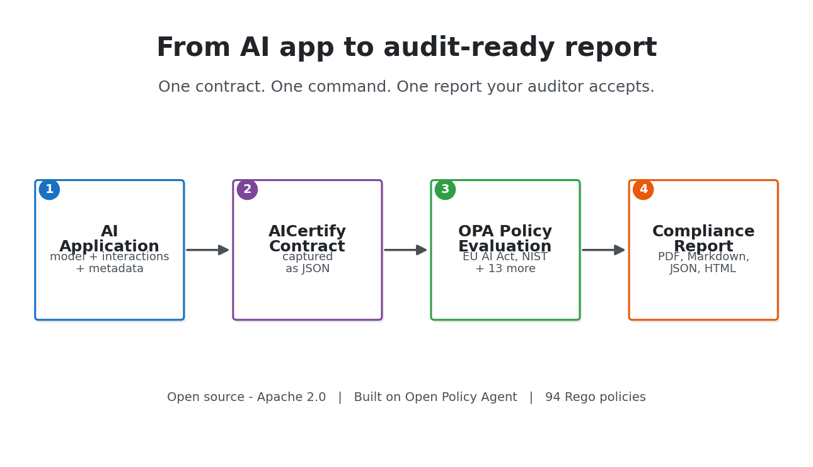
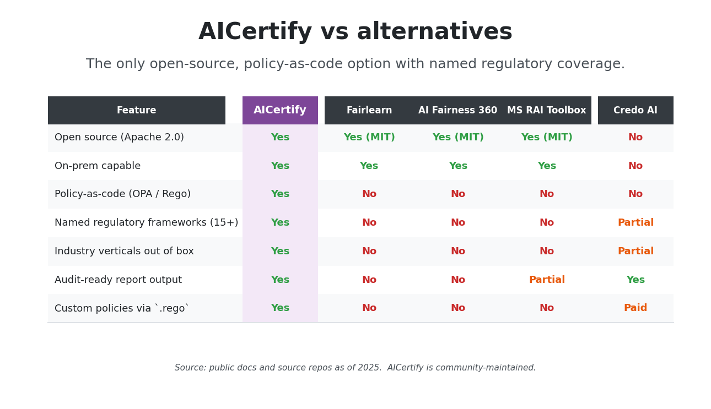
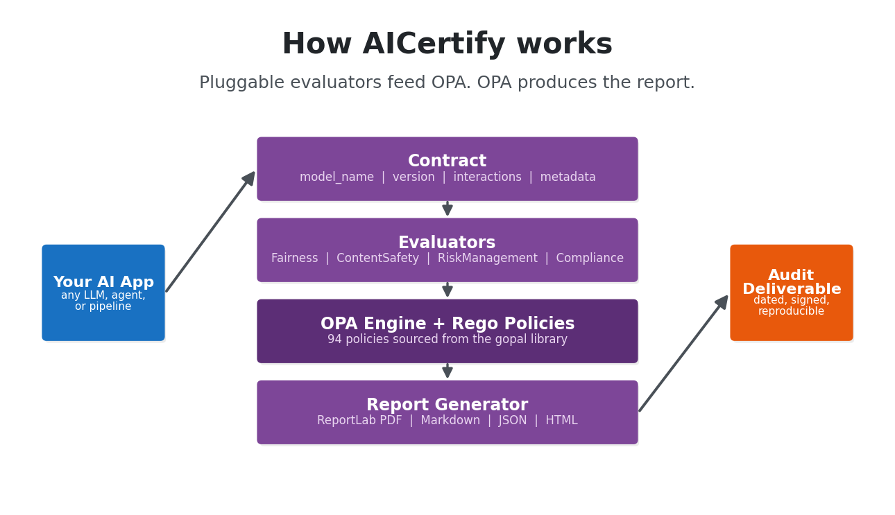
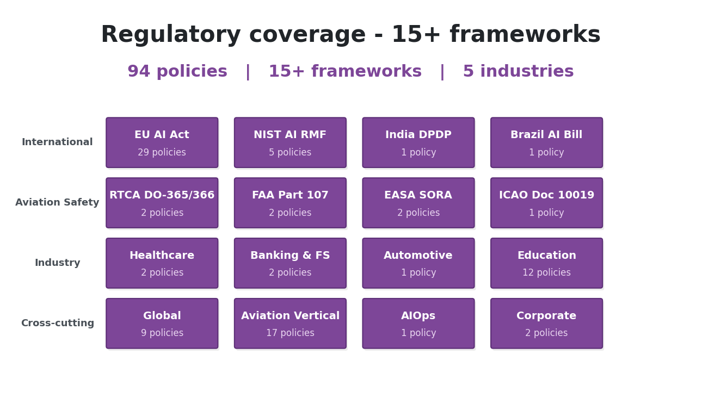
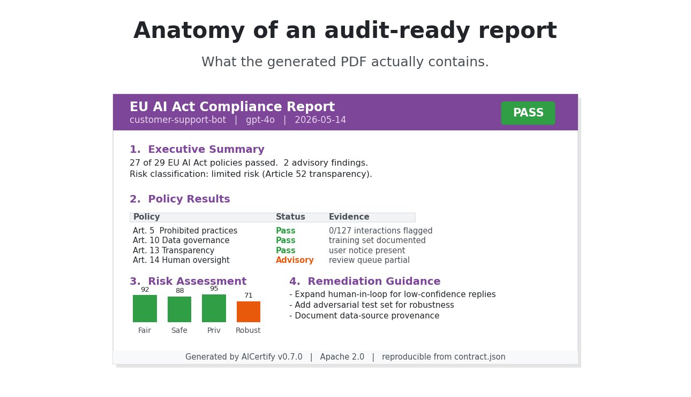

<div align="center">
  
</div>

<h1 align="center">AICertify</h1>

<p align="center">
  <a href="README.md">English</a> |
  <strong>简体中文</strong> |
  <a href="README.ja-JP.md">日本語</a> |
  <a href="README.ko-KR.md">한국어</a> |
  <a href="README.hi-IN.md">हिन्दी</a>
</p>

<p align="center">
  <strong>面向 AI 系统的合规即代码。</strong>
</p>

<p align="center">
  <em>依据 EU AI Act、NIST AI RMF 等 15 项框架审计您的 AI —— 一份合约、一条命令、一份报告。</em>
</p>

<p align="center">
  <a href="https://pypi.org/project/aicertify/"></a>
  <a href="https://pepy.tech/project/aicertify"></a>
  <a href="https://github.com/Principled-Evolution/aicertify/actions/workflows/aicertify-ci.yaml"></a>
  <a href="https://github.com/Principled-Evolution/aicertify/stargazers"></a>
  <a href="https://www.python.org/"></a>
  <a href="https://opensource.org/licenses/Apache-2.0"></a>
  <a href="https://www.openpolicyagent.org/"></a>
  <a href="https://github.com/Principled-Evolution/gopal"></a>
  <a href="https://github.com/Principled-Evolution/aicertify#status"></a>
  <a href="https://makeapullrequest.com"></a>
</p>

<p align="center">
   AICertify 合约 -> OPA 策略评估 -> 合规报告" width="85%" />
</p>

<br>

监管机构推进的速度比您的治理文档更快。EU AI Act 已经生效。NIST AI RMF 已成为美国事实上的标准。印度、巴西和新加坡也将紧随其后。`AICertify` 让您能够将这些义务编码为可执行的 [Open Policy Agent](https://www.openpolicyagent.org/) 策略,在采集的 AI 交互数据上运行,并生成 PDF、Markdown、JSON 或 HTML 格式的审计就绪报告。

它是连接"我们有负责任的 AI 策略"与"我们能够证明这一点"之间缺失的一环。

---

## 快速开始

```bash
pip install aicertify
```

运行内置演示(克隆仓库以获取示例合约和示例代码):

```bash
git clone https://github.com/Principled-Evolution/aicertify.git
cd aicertify
python examples/quickstart.py
```

quickstart 会将一个示例 AI 应用接入 EU AI Act 策略集,并将合规报告写入 `reports/`。打开看看 —— 这就是您的审计交付物的样貌:由系统生成,而非手工撰写。

### 用于开发

```bash
git clone https://github.com/Principled-Evolution/aicertify.git
cd aicertify
pip install -e .
```

### 最简 Python 用法

```python
from aicertify import regulations, application

# 1. 选择需要认证的法规
regs = regulations.create("my_regulations")
regs.add("eu_ai_act")

# 2. 包装您的 AI 应用
app = application.create(
    name="customer-support-bot",
    model_name="gpt-4o",
    model_version="2024-08-06",
)

# 3. 输入真实的交互数据
app.add_interaction(
    input_text="I want a refund for my order",
    output_text="I can help with that. Could you share your order number?",
)

# 4. 评估并取回报告
await app.evaluate(regulations=regs, report_format="pdf", output_dir="reports")
```

整个闭环就这么简单。**合约 → 交互 → 评估 → 报告。**

---

## 为何选择 AICertify

大多数 AI 治理工具不外乎两类:

- **厂商 SaaS**,将您的审计轨迹锁在登录页之后(Credo AI、Holistic AI),或
- **研究工具包**,只聚焦单一维度 —— 公平性指标(Fairlearn、AI Fairness 360)或可解释性(Microsoft RAI Toolbox)。

二者都无法产出监管机构真正索要的文件:*您依据某项具名法规对该 AI 系统进行了测试的证据,包含可复现的策略与带日期的报告。*

AICertify 正是为这份交付物而生。

<p align="center">
  
</p>

| | AICertify | Fairlearn / AIF360 | MS RAI Toolbox | Credo AI |
|---|---|---|---|---|
| 开源 | ✅ Apache 2.0 | ✅ MIT | ✅ MIT | ❌ 闭源 |
| 本地部署 / 内网隔离 | ✅ | ✅ | ✅ | ❌ |
| 具名法规框架 | **EU AI Act、NIST RMF、Brazil AI Bill、India DPDP 等 15+** | ❌(仅公平性) | ❌(工具包) | ✅ |
| 策略即代码(可审计、可对比) | ✅ OPA / Rego | ❌ | ❌ | ❌ |
| 开箱即用的行业垂直领域 | 航空、银行、医疗、汽车、教育 | ❌ | ❌ | 部分 |
| 生成审计就绪报告 | ✅ PDF / MD / JSON / HTML | ❌ | 部分 | ✅ |
| 自定义策略 | ✅ 放入一个 `.rego` 文件即可 | ❌ | 不适用 | ✅(付费) |

---

## 工作原理

<p align="center">
  
</p>

1. **合约(Contract)** —— 用 JSON 描述您的 AI 应用:模型、版本、采集的交互、元数据。
2. **评估器(Evaluators)** —— 可插拔的 Python 评估器(Fairness、ContentSafety、RiskManagement、Compliance),从交互数据中提取指标。
3. **OPA 策略** —— 指标依据法规对应的 Rego 策略进行评估(策略来自 [gopal](https://github.com/Principled-Evolution/gopal) 策略库)。
4. **报告** —— 一份格式化、带日期的交付物,可直接交给法务、审计师或 AI 风险委员会。

由于策略是声明式的 Rego,它们可像任何代码一样进行版本管理、差异比对和评审。法规变更时,您只需升级策略,而无需修改评估流水线。

---

## 法规覆盖

<p align="center">
  
</p>

AICertify 运行于 [gopal](https://github.com/Principled-Evolution/gopal) 策略库之上 —— **94 条生产级 OPA 策略**,覆盖以下框架:

### 国际

- **EU AI Act** —— 29 条策略,涵盖禁止性实践、生物识别、操纵行为、透明度、技术文档、人类监督、GPAI 义务
- **NIST AI RMF** —— Govern、Map、Measure、Manage 以及 AI 600-1
- **India Digital Policy** —— 对齐 DPDP 的义务要求
- **Brazil AI Governance Bill** —— 算法治理要求
- **航空标准** —— ICAO Doc 10019、RTCA DO-365/366、ASTM F3442、ISO 21384、FAA Part 107、EASA SORA

### 行业专属

- **航空**(17 条策略) —— 感知与规避、适航认证、设计、集成验证
- **教育**(12 条策略) —— FERPA、COPPA、在线监考、人类参与的评分
- **银行与金融服务** —— 模型风险、公平借贷
- **医疗** —— 患者安全、诊断安全
- **汽车** —— 车辆安全集成

### 全球与运营

- **全球** —— 问责、公平、透明、可解释性、内容安全、风险管理、安全
- **企业** —— 信息安全、治理
- **AIOps 与成本** —— 可扩展性、资源效率

没有看到您关心的法规?[添加一个 Rego 文件](https://github.com/Principled-Evolution/gopal/blob/main/CONTRIBUTING.md)即可。该策略库本就为可扩展而设计。

---

## 命令行(CLI)

```bash
python -m aicertify.cli \
  --contract path/to/contract.json \
  --policy aicertify/opa_policies/international/eu_ai_act/v1 \
  --report-format pdf \
  --output-dir reports/
```

常用参数:

| 参数 | 用途 |
|---|---|
| `--contract` | AI 应用合约 JSON 的路径 |
| `--policy` | 要使用的 OPA 策略目录路径 |
| `--report-format` | `pdf`、`markdown`、`json`、`html`(默认:`pdf`) |
| `--evaluators` | 限定特定评估器(例如 `Fairness ContentSafety`) |
| `--output-dir` | 报告输出目录(默认:`./reports`) |
| `--verbose` | 详细日志 |

完整的 Python API 请参阅 [`examples/quickstart.py`](examples/quickstart.py)。

---

## 示例报告

<p align="center">
  
</p>

`examples/outputs/` 目录中包含来自真实评估的生成报告,您可以在运行前先行查阅:

- `eu_ai_act/` —— 一个客户支持智能体依据 EU AI Act 的评估
- `loan_evaluation/` —— 一个信用评分模型的公平借贷评估
- `medical_diagnosis/` —— 一个临床决策支持模型的患者安全评估

打开这些 PDF,这正是审计师想要的样子。

---

## 状态

AICertify 目前处于 **beta(v0.7.0)** 阶段 —— 1.0 版本发布前 API 仍可能演进。已可用于生产的框架包括:

- ✅ EU AI Act
- ✅ 全球评估器(公平性、内容安全、透明度)
- ✅ 医疗、银行金融服务、汽车行业策略
- ✅ 航空策略集(RTCA、ASTM、FAA、EASA)
- 🚧 NIST AI RMF —— 部分覆盖
- 🚧 India Digital Policy —— 早期阶段

在[策略库路线图](https://github.com/Principled-Evolution/gopal)中跟踪进展。

---

## 参与贡献

我们欢迎:

- 新的法规框架(请先开 issue 对齐范围)
- 您已在生产中验证的行业策略
- 新的评估器(公平性、安全性、鲁棒性 —— 参见 `aicertify/evaluators/`)
- 附带最小可复现合约的缺陷报告

请从 [CONTRIBUTING.md](CONTRIBUTING.md) 与[行为准则](CODE_OF_CONDUCT.md)开始。

---

## 相关项目

- **[gopal](https://github.com/Principled-Evolution/gopal)** —— AICertify 底层使用的 OPA 策略库。如不需要 Python 框架,可搭配 OPA CLI 独立使用。
- **[Open Policy Agent](https://www.openpolicyagent.org/)** —— 策略引擎。
- **[Regal](https://github.com/StyraInc/regal)** —— 用于保持策略整洁的 Rego 代码检查工具。

---

## 许可证

Apache License 2.0 —— 参见 [LICENSE](LICENSE)。

<p align="center"><sub>由 <a href="https://github.com/Principled-Evolution">Principled Evolution</a> 构建 · 可读、可运行、可证明的策略。</sub></p>
