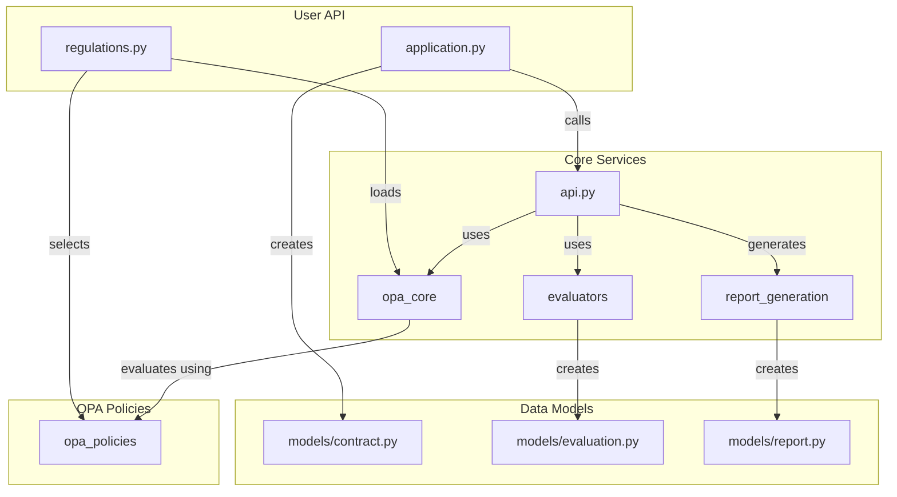
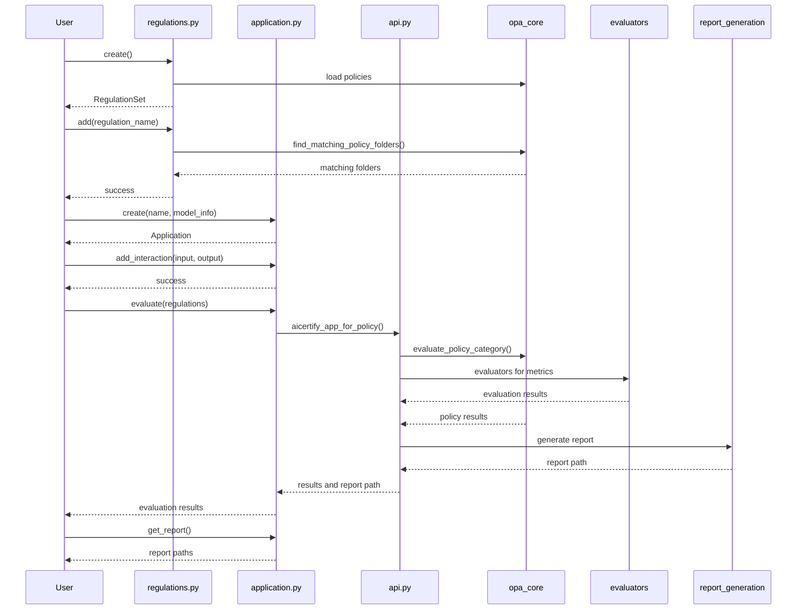

# AICertify Architecture and Flow Diagram

This document provides diagrams to help understand the architecture and flow of the AICertify library.

## Component Diagram

## Sequence Diagram

## Implementation Notes

### Key Features

1. **Simple API**: Users only need to interact with `regulations` and `application` modules.
2. **Flexible Regulation Selection**: Users can select specific regulations to evaluate against.
3. **Rich Report Generation**: Comprehensive reports are generated in various formats.
4. **Extensible**: New regulations and evaluators can be added without changing the API.

### Using the Library

The AICertify library follows a simple workflow:

1. Create a regulations set
2. Add specific regulations to the set
3. Create an application
4. Add interactions to the application
5. Evaluate the application against regulations
6. Get the generated reports

### Example Implementation

See the `quickstart.py` file for a complete working example of using the AICertify library.

### Customization Options

- Specify report formats: markdown, PDF, or JSON
- Configure output directories for reports
- Add custom metadata to applications and interactions
- Select specific regulations based on your compliance needs 