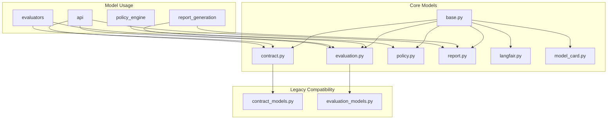

# AICertify Models

This directory contains all the centralized data models used by AICertify.

## Model Structure

The models are organized into the following categories:



## Model Categories

### Base Models (base.py)
Common utilities and base classes used across all models.

### Contract Models (contract.py)
Models for representing AI contracts, including:
- `ModelInfo`: Information about AI models
- `Interaction`: Represents user-AI interactions
- `AiCertifyContract`: Main contract model for evaluation

### Evaluation Models (evaluation.py)
Models for representing evaluation results, including:
- `MetricValue`: Base model for metric values
- `AiEvaluationResult`: Results from multiple evaluators
- `AiComplianceInput`: Input to OPA policy engine

### Report Models (report.py)
Models for representing evaluation reports, including:
- `MetricGroup`: Groups related metrics
- `PolicyResult`: Results of policy evaluations
- `ApplicationDetails`: Basic application details
- `EvaluationReport`: Main report model

### Policy Models (policy_models.py)
Models for representing policy parameters and configurations.

### Model Card (model_card.py)
Models for representing detailed model documentation.

### LangFair Evaluation Models (langfair_eval.py)
Models for representing LangFair evaluation results.

## Legacy Compatibility

For backward compatibility, the following modules re-export models from the centralized location:

- `contract_models.py`: Re-exports from `contract.py`
- `evaluation_models.py`: Re-exports from `contract.py` and `evaluation.py`

These modules are maintained for backward compatibility and should not be used for new code.

## Usage

Import models directly from the centralized location:

```python
from aicertify.models import MetricValue, EvaluationReport, AiCertifyContract
```

Or import specific models from their respective modules:

```python
from aicertify.models.evaluation import MetricValue, AiEvaluationResult
from aicertify.models.report import EvaluationReport
from aicertify.models.contract import AiCertifyContract
``` 