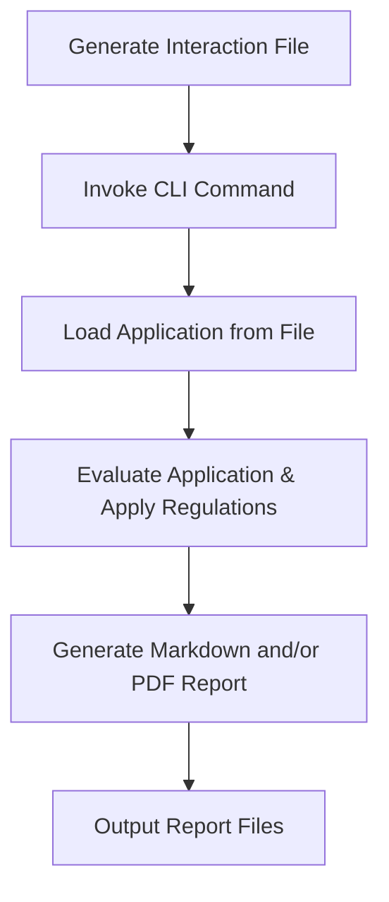
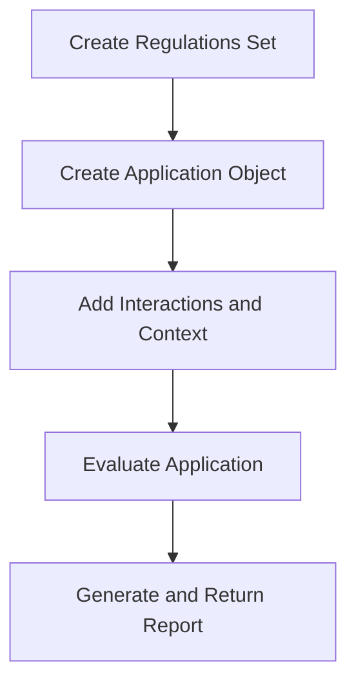

## AICertify Developer Guide

Welcome to the AICertify Developer Guide. This document provides step-by-step instructions for integrating with AICertify using our supported methods: file-based evaluation through the CLI and the Python API.

## Table of Contents

- [Integration Methods Overview](#integration-methods-overview)
- [1. File-Based Evaluation (CLI)](#1-file-based-evaluation-cli)
  - [Workflow Diagram](#workflow-diagram)
  - [Step-by-Step Instructions](#step-by-step-instructions)
- [2. Python API Integration](#2-python-api-integration)
  - [Current Regulations/Application API](#current-regulationsapplication-api)
  - [Legacy Contract-Based API](#legacy-contract-based-api)
  - [Workflow Diagram](#workflow-diagram-1)
- [Tips for a Smooth Developer Experience](#tips-for-a-smooth-developer-experience)
- [FAQ](#faq)
- [Medical Diagnosis Example using the API](#medical-diagnosis-example-using-the-api)
  - [Advanced Integration Example](#advanced-integration-example)
  - [Integration Breakdown](#integration-breakdown)
  - [Running the Example](#running-the-example)
  - [Integration in Your Own Application](#integration-in-your-own-application)
  - [Handling External Model Dependencies](#handling-external-model-dependencies)
- [Loan Application Evaluator Example with PDF Reports](#loan-application-evaluator-example-with-pdf-reports)
  - [Overview](#overview)
  - [Key Components](#key-components)
  - [Running the Example](#running-the-example-1)
  - [Integration Code Breakdown](#integration-code-breakdown)
  - [Developer Tips for PDF Reports](#developer-tips-for-pdf-reports)
- [EU AI Act Compliance](#eu-ai-act-compliance)
  - [Model Card Interface](#model-card-interface)
  - [Simplified Evaluation for EU AI Act](#simplified-evaluation-for-eu-ai-act)
  - [Focus Areas for EU AI Act Compliance](#focus-areas-for-eu-ai-act-compliance)
  - [EU AI Act Risk Categories](#eu-ai-act-risk-categories)

---

## Integration Methods Overview

AICertify supports two streamlined integration methods:

1. **File-Based Evaluation (CLI)**: Developers create interaction files in JSON format and use our CLI to evaluate and generate reports.

2. **Python API Integration**: Developers leverage our Python API to programmatically evaluate AI applications and generate reports directly within their applications.

---

## 1. File-Based Evaluation (CLI)

### Workflow Diagram

Below is a Mermaid diagram illustrating the file-based evaluation process:



### Step-by-Step Instructions

1. **Create an Interaction File**: Format your application as a JSON file. See the example below:

```json
{
  "name": "MyApp",
  "model_name": "GPT-4",
  "model_version": "latest",
  "interactions": [
    {
      "input_text": "User prompt",
      "output_text": "AI response",
      "metadata": {}
    }
  ]
}
```

Save this file in the `/examples` directory as `sample_application.json`.

2. **Run the Evaluation CLI Command**: Use the command below to run the evaluation and generate reports:

```bash
python -m aicertify.cli.evaluate --application examples/sample_application.json --regulation eu_ai_act
```

3. **Examine the Generated Reports**: After execution, the CLI produces Markdown and/or PDF report files in the designated output directory.

---

## 2. Python API Integration

AICertify provides two API approaches: the current Regulations/Application API (recommended) and the legacy Contract-Based API (maintained for backward compatibility).

### Current Regulations/Application API

The modern API uses higher-level abstractions for a more intuitive developer experience:

```python
import asyncio
from aicertify import regulations, application

async def main():
    # Create a regulations set
    regulations_set = regulations.create("eu_ai_act_evaluation")
    regulations_set.add("eu_ai_act")

    # Create an application
    app = application.create(
        name="My AI Assistant",
        model_name="GPT-4",
        model_version="latest"
    )

    # Add interactions
    app.add_interaction(
        input_text="What is the capital of France?",
        output_text="The capital of France is Paris."
    )

    # Add context information
    app.add_context({
        "risk_documentation": "Risk assessment documentation...",
        "model_information": {
            "training_data": "Publicly available datasets",
            "intended_use": "Educational assistant"
        }
    })

    # Evaluate the application
    results = await app.evaluate(
        regulations=regulations_set,
        report_format="html",
        output_dir="./reports"
    )

    print(f"Report saved to: {results.get('report_path')}")

# Run the evaluation
asyncio.run(main())
```

This approach is recommended for all new integrations as it provides a cleaner, more intuitive API with better abstraction of regulatory concepts.

### Legacy Contract-Based API

For backward compatibility, we maintain the original contract-based API:

```python
import asyncio
from aicertify.models.contract_models import create_contract
from aicertify.api import evaluate_contract_with_phase1_evaluators

# Create a contract
contract = create_contract(
    application_name="MyApp",
    model_info={"model_name": "GPT-4", "model_version": "latest"},
    interactions=[
        {"input_text": "User prompt", "output_text": "AI response", "metadata": {}}
    ],
    context={"risk_documentation": "Risk assessment documentation..."}
)

# Evaluate the contract
async def evaluate():
    results = await evaluate_contract_with_phase1_evaluators(
        contract=contract,
        generate_report=True,
        report_format="markdown",
        output_dir="./reports"
    )
    print(f"Report saved to: {results.get('report_path')}")

asyncio.run(evaluate())
```

While this API is still supported, we recommend migrating to the Regulations/Application API for new development.

### Workflow Diagram

This diagram shows how to integrate using the recommended Regulations/Application API:



---

## Tips for a Smooth Developer Experience

- **Use Current API**: The Regulations/Application API provides a more intuitive developer experience and is recommended for all new integrations.
- **Naming Conventions**: Follow snake_case for your JSON keys and Python object fields.
- **See Quickstart**: Check `aicertify/examples/quickstart.py` for a complete example using the current API.
- **Troubleshooting**: Check logs for detailed error messages and review the sample files in `/examples` for reference.

---

## FAQ

1. **Q: Which API should I use for new projects?**

   A: Use the Regulations/Application API (`from aicertify import regulations, application`) for all new projects. It provides a more intuitive developer experience.

2. **Q: Is the legacy API still supported?**

   A: Yes, we maintain backward compatibility with the legacy contract-based API, but recommend the current API for new development.

3. **Q: Where can I find a complete example using the current API?**

   A: Check `aicertify/examples/quickstart.py` for a complete example using the Regulations/Application API.

4. **Q: What if I need additional report formats?**

   A: Currently, HTML, Markdown, and PDF reports are supported. Future releases plan to extend report customization.

---

## Medical Diagnosis Example using the API

This section demonstrates how to integrate the AICertify API with a complex medical diagnosis application to evaluate AI interactions and generate compliance reports. The example below shows the simplest possible integration with a real-world, multi-agent diagnosis system.

### Advanced Integration Example

The [Medical-Diagnosis-MultiSpecialist-Agents.py](../examples/Medical-Diagnosis-MultiSpecialist-Agents.py) script demonstrates how to integrate AICertify into a complex medical application that uses multiple specialized AI agents (cardiology, neurology, gastroenterology, and primary care) to provide medical diagnosis.

Here's an updated integration example using the current Regulations/Application API:

```python
# After capturing AI interactions
from aicertify import regulations, application
import asyncio

# Create a regulations set for EU AI Act
regulations_set = regulations.create("medical_diagnosis_evaluation")
regulations_set.add("eu_ai_act")

# Create an application
app = application.create(
    name="Medical Diagnosis Session",
    model_name="gpt-4o-mini",
    model_metadata={"provider": "OpenAI"}
)

# Add captured interactions
for interaction in captured_interactions:
    app.add_interaction(
        input_text=interaction["input_text"],
        output_text=interaction["output_text"],
        metadata=interaction["metadata"]
    )

try:
    # Evaluate the application
    eval_result = asyncio.run(app.evaluate(
        regulations=regulations_set,
        report_format='markdown',
        output_dir=contract_storage
    ))

    # Log evaluation results
    logger.info(f'Application evaluation complete')
    if eval_result.get('report_path'):
        logger.info(f'Evaluation report saved to: {eval_result.get("report_path")}')
    else:
        logger.info('Report generated but path not returned')

except Exception as ex:
    logger.exception(f'Error during application evaluation: {ex}')
```

### Integration Breakdown

1. **Capturing AI Interactions**: The medical diagnosis application captures interactions with multiple specialized AI agents:

   ```python
   captured_interactions.append({
       "input_text": question,
       "output_text": result.data.diagnosis,
       "metadata": {"agent": "Cardiology"}  # Metadata includes agent type
   })
   ```

2. **Creating the Application**: After capturing interactions, create an AICertify application:

   ```python
   from aicertify import application

   app = application.create(
       name="Medical Diagnosis Session",
       model_name="gpt-4o-mini",
       model_metadata={"provider": "OpenAI"}
   )

   # Add interactions
   for interaction in captured_interactions:
       app.add_interaction(
           input_text=interaction["input_text"],
           output_text=interaction["output_text"],
           metadata=interaction["metadata"]
       )
   ```

3. **Integration with AICertify API**: The minimal code needed to evaluate the application:

   ```python
   # Simple integration using Regulations/Application API
   from aicertify import regulations
   import asyncio

   # Create regulations set
   regulations_set = regulations.create("medical_diagnosis_evaluation")
   regulations_set.add("eu_ai_act")

   # Evaluate application
   eval_result = asyncio.run(app.evaluate(
       regulations=regulations_set,
       report_format='markdown'
   ))
   ```

### Running the Example

To run the full medical diagnosis example with application evaluation:

```bash
python examples/Medical-Diagnosis-MultiSpecialist-Agents.py --capture-contract
```

This will:
1. Run the medical diagnosis session with multiple AI agents
2. Create an AICertify application from the captured interactions
3. Evaluate the application using the AICertify API
4. Generate a compliance report in the `examples/outputs/medical_diagnosis` directory

All example scripts in the AICertify repository generate outputs in a consistent subfolder structure:
- `examples/outputs/{example_name}` - Stores contracts and reports for each example
- `examples/outputs/temp_reports` - Temporary storage for generated reports

This ensures all outputs are contained within the examples directory for easy access and reference.

### Integration in Your Own Application

To integrate AICertify in your own application:

1. **Capture AI Interactions**: Record all AI inputs and outputs in your application
2. **Create a Regulations Set**: Define which regulations to evaluate against
3. **Create an Application**: Use the `application.create()` function to define your AI application
4. **Add Interactions**: Add all captured interactions to your application
5. **Evaluate Compliance**: Use `app.evaluate()` to verify compliance and generate reports

The simplicity of integration—just a few lines of code—showcases how easily AICertify can be incorporated into complex, real-world AI applications.

### Handling External Model Dependencies

The Medical Diagnosis example uses both OpenAI and Ollama models. If you're running the example without Ollama installed, you might encounter connection errors. The example includes graceful fallbacks, but here are some tips:

1. **Check Ollama Installation**: If using Ollama models, ensure the Ollama server is running with:
   ```bash
   # Install Ollama if needed
   curl -fsSL https://ollama.com/install.sh | sh

   # Start Ollama server
   ollama serve

   # Pull the model (in a separate terminal)
   ollama pull deepseek-r1
   ```

2. **Use Only OpenAI Models**: You can modify the example to use only OpenAI models by changing the `reasoning_agent` definition.

3. **Add Pre-checks**: Always add connection pre-checks when integrating with external services:
   ```python
   def check_service_available(url, timeout=2):
       import requests
       try:
           response = requests.get(url, timeout=timeout)
           return response.status_code == 200
       except requests.exceptions.RequestException:
           return False
   ```

---

## Loan Application Evaluator Example with PDF Reports

This section demonstrates a simpler integration pattern using AICertify to evaluate a loan application agent with PDF report generation. This example is perfect for fintech applications that need compliance verification with shareable PDF artifacts.

### Overview

The [Loan-Application-Evaluator.py](../examples/Loan-Application-Evaluator.py) script showcases how to integrate AICertify into a financial services application that uses an AI agent to make loan approval decisions. The integration demonstrates:

1. A simpler single-agent workflow (compared to the medical diagnosis multi-agent example)
2. PDF report generation for formal documentation
3. Enhanced metadata capture for better traceability

### Key Components

#### 1. The Loan Decision Agent

The example creates an AI agent that evaluates loan applications using customer information:

```python
agent = Agent(
    model=model,
    result_type=LoanDecision,
    system_prompt="You are a loan officer for a lending institution...",
    deps_type=Deps
)
```

#### 2. Capturing Rich Metadata

The example captures detailed metadata about the loan decision, enhancing the evaluation:

```python
captured_interactions.append({
    "input_text": question,
    "output_text": result.data.response,
    "metadata": {
        "agent": "LoanDecision",
        "response_type": result.data.response_type,
        "loan_amount": result.data.loan_amount,
        "loan_term": result.data.term
    }
})
```

#### 3. PDF Report Generation

Using the Regulations/Application API with PDF report generation:

```python
from aicertify import regulations, application
import asyncio

# Create regulations set
regulations_set = regulations.create("loan_evaluation")
regulations_set.add("eu_ai_act")

# Create application
app = application.create(
    name="Loan Application Evaluation",
    model_name="gpt-4o-mini"
)

# Add interactions
for interaction in captured_interactions:
    app.add_interaction(
        input_text=interaction["input_text"],
        output_text=interaction["output_text"],
        metadata=interaction["metadata"]
    )

# Evaluate application with PDF report
eval_result = asyncio.run(app.evaluate(
    regulations=regulations_set,
    report_format="pdf",
    output_dir=contract_storage
))

print(f"PDF report saved to: {eval_result.get('report_path')}")
```

### Running the Example

To run the loan application example with evaluation and PDF reporting:

```bash
python examples/Loan-Application-Evaluator.py --capture-contract --report-format pdf
```

This will:
1. Run the loan evaluation with a simulated customer profile
2. Create an AICertify application from the captured interaction
3. Evaluate the application using the AICertify API
4. Generate a PDF compliance report in the `examples/outputs/loan_evaluation` directory

You can specify a custom output directory with the `--contract-storage` parameter:

```bash
python examples/Loan-Application-Evaluator.py --capture-contract --report-format pdf --contract-storage my_custom_output
```

### Integration Code Breakdown

Here's the minimal code needed to integrate AICertify for PDF report generation:

```python
from aicertify import regulations, application
import asyncio

# Create regulations set
regulations_set = regulations.create("loan_evaluation")
regulations_set.add("eu_ai_act")

# Create application
app = application.create(
    name="Loan Application Evaluation",
    model_name="gpt-4o-mini"
)

# Add interactions from captured data
for interaction in captured_interactions:
    app.add_interaction(
        input_text=interaction["input_text"],
        output_text=interaction["output_text"],
        metadata=interaction["metadata"]
    )

# Evaluate application with PDF report
eval_result = asyncio.run(app.evaluate(
    regulations=regulations_set,
    report_format="pdf",
    output_dir="reports"
))

print(f"PDF report saved to: {eval_result.get('report_path')}")
```

### Developer Tips for PDF Reports

When generating PDF reports for compliance documentation:

1. **Ensure Proper Metadata**: Include relevant metadata in your interactions to enhance the report content
2. **Custom Storage Path**: Use the `output_dir` parameter to organize reports in your application's folder structure
3. **PDF Benefits**: PDF reports are ideal for financial applications where formal documentation is required
4. **Error Handling**: Always include proper error handling around the API call as shown in the example

This loan application example demonstrates a streamlined approach to integrating AICertify into financial applications where formal PDF documentation is essential for regulatory compliance.

---

## EU AI Act Compliance

The AICertify framework provides specialized support for evaluating compliance with the EU AI Act requirements. This section outlines the enhanced interfaces and tools designed specifically for EU AI Act compliance evaluation.

### Model Card Interface

The ModelCard interface provides a structured way to document your AI model following HuggingFace Model Card format with additional fields required for EU AI Act compliance:

```python
from aicertify.models.model_card import ModelCard, create_model_card

# Create a model card with minimum required fields
model_card = create_model_card(
    model_name="MyAIModel",
    model_type="text-generation",
    organization="MyCompany",
    primary_uses=["Customer support automation"],
    description="Large language model for customer support"
)

# Or create a more detailed model card
model_card = ModelCard(
    model_name="HealthcareGPT",
    model_version="1.0.0",
    model_type="text-generation",
    organization="Health AI Inc.",
    primary_uses=["Medical diagnosis assistance", "Healthcare information"],
    out_of_scope_uses=["Direct medical diagnosis without human review"],
    description="Large language model fine-tuned for healthcare domain.",
    model_architecture="Transformer-based with 1B parameters",
    input_format="Natural language text queries",
    output_format="Natural language text responses",
    performance_metrics={
        "accuracy": 0.92,
        "f1_score": 0.89
    },
    ethical_considerations=[
        "Data privacy concerns",
        "Potential biases in medical training data"
    ],
    limitations=[
        "Limited knowledge cutoff",
        "Not a replacement for medical professionals"
    ],
    mitigation_strategies=[
        "Human oversight required for all diagnoses",
        "Clear confidence levels provided with responses"
    ],
    risk_category="high",
    relevant_articles=["Article 10", "Article 14"]
)
```

### Simplified Evaluation for EU AI Act

For EU AI Act compliance evaluation, we provide a simplified interface using the Regulations/Application API:

```python
from aicertify import regulations, application
from aicertify.models.model_card import create_model_card
import asyncio

# Create a model card
model_card = create_model_card(
    model_name="HealthcareGPT",
    model_type="text-generation",
    organization="Health AI Inc.",
    primary_uses=["Medical diagnosis assistance"],
    description="Healthcare assistant AI"
)

# Create a regulations set specifically for EU AI Act
regulations_set = regulations.create("eu_ai_act_evaluation")
regulations_set.add("eu_ai_act", focus_areas=["prohibited_practices", "documentation"])

# Create an application with the model card
app = application.create(
    name="Healthcare Assistant",
    model_name="HealthcareGPT",
    model_version="1.0.0",
    model_card=model_card
)

# Add interactions
app.add_interaction(
    input_text="What are the symptoms of pneumonia?",
    output_text="Pneumonia symptoms include chest pain, cough, fatigue, fever, and shortness of breath.",
    metadata={"topic": "medical_information"}
)

# Evaluate EU AI Act compliance
result = asyncio.run(app.evaluate(
    regulations=regulations_set,
    report_format="pdf",
    output_dir="reports"
))

# Print the compliance result
print(f"Overall compliance: {result.get('overall_compliant', False)}")
print(f"Report path: {result.get('report_path', 'No report generated')}")
```

### Focus Areas for EU AI Act Compliance

When configuring the EU AI Act regulation, you can specify focus areas to target specific aspects of compliance:

- `"prohibited_practices"`: Evaluates for manipulative techniques, vulnerability exploitation, social scoring, and emotion recognition
- `"documentation"`: Assesses technical documentation via model card evaluation
- `"technical_robustness"`: Checks accuracy and factual consistency
- `"fairness"`: Evaluates for bias and discriminatory practices
- `"content_safety"`: Assesses content toxicity and safety
- `"risk_management"`: Evaluates risk management measures
- `"biometric"`: Checks biometric categorization compliance

### EU AI Act Risk Categories

The EU AI Act defines different risk categories for AI systems:

- `"minimal"`: AI systems with minimal or no risk
- `"limited"`: AI systems with limited risk
- `"high"`: High-risk AI systems subject to strict requirements
- `"unacceptable"`: AI systems with unacceptable risk, which are prohibited

You can specify the risk category in your model card:

```python
model_card = create_model_card(
    # ... other fields ...
    risk_category="high",
    relevant_articles=["Article 10", "Article 14"]
)
```

This information will be used in the evaluation to apply the appropriate level of scrutiny based on the risk category.

---

Happy Evaluating!

For further details, refer to the [README](../README.md) and our further API documentation.
