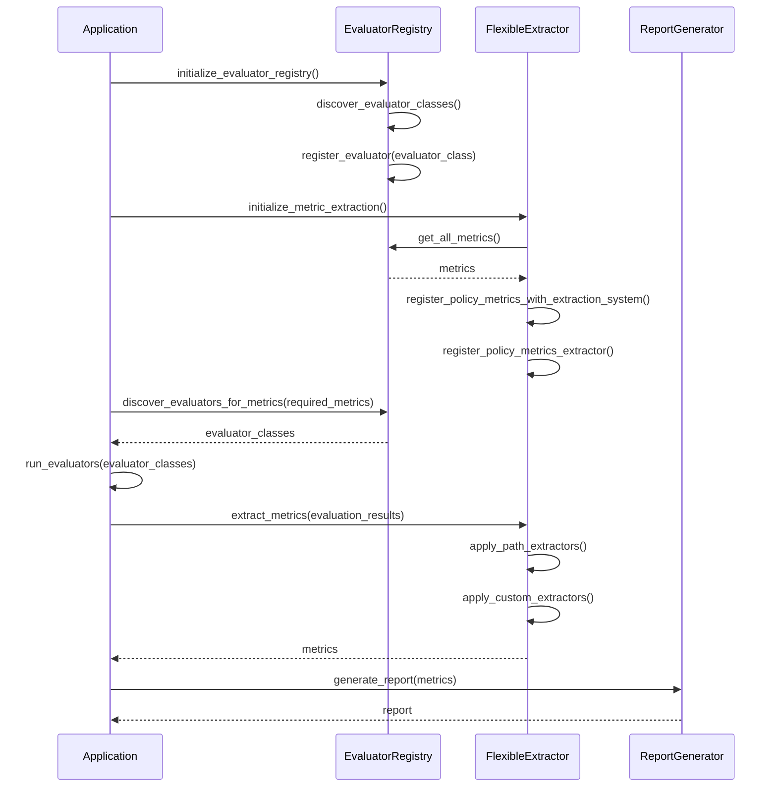
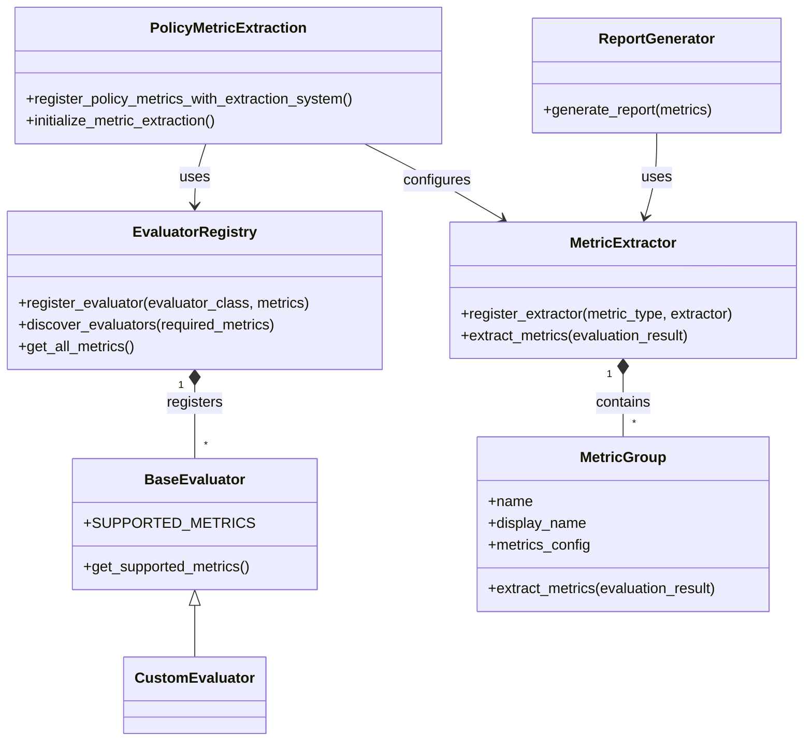

# Flexible Metric Extraction System

## Overview

The Flexible Metric Extraction System is a registry-based approach to extracting metrics from evaluation results in AICertify. It provides a flexible and extensible way to extract metrics from various data structures, making it easier to add new evaluators and metrics without modifying code in multiple places.

## Key Features

- **Registry-based approach**: Metric extractors are registered with a central registry, allowing for easy extension.
- **Path-based extraction**: Metrics can be extracted from nested data structures using dot-notation paths.
- **Configuration-driven**: Metric extraction can be configured using JSON configuration files.
- **Default configurations**: Default configurations are provided for common metric types.
- **Feature flags**: The system can be enabled or disabled using feature flags.
- **Plugin system**: Custom extractors can be registered for new metric types.
- **Evaluator Registry Integration**: Automatic extraction of metrics based on the evaluator registry.
- **Policy Parameter Support**: Integration with the policy parameter system.

## Architecture

The system consists of the following components:

1. **MetricExtractor**: A registry-based class that manages metric extractors and provides methods for extracting metrics.
2. **MetricGroup**: A class that represents a group of related metrics and provides methods for extracting those metrics.
3. **Path-based extraction**: Functions for extracting values from nested data structures using dot-notation paths.
4. **Configuration system**: Functions for loading and registering metric configurations.
5. **Feature flags**: Configuration options for enabling or disabling the system.
6. **Plugin system**: Mechanisms for registering custom extractors.
7. **Policy Metric Extraction**: Integration with the evaluator registry to support OPA policy metrics.

## Usage

### Enabling the System

The flexible extraction system can be enabled using the `AICERTIFY_USE_FLEXIBLE_EXTRACTION` environment variable:

```bash
export AICERTIFY_USE_FLEXIBLE_EXTRACTION=true
```

Alternatively, it can be enabled programmatically:

```python
from aicertify.report_generation.config import set_feature_flag

set_feature_flag("use_flexible_extraction", True)
```

### Using Default Configurations

The system comes with default configurations for common metric types:

- Fairness metrics
- Toxicity metrics
- Stereotype metrics
- Performance metrics
- Accuracy metrics

These configurations are automatically registered when the system is initialized.

## Policy Metric Integration

The system includes integration with the evaluator registry to support OPA policy metrics:

### Automatic Policy Metric Registration

When the application starts, it automatically:

1. Discovers metrics supported by registered evaluators via the evaluator registry
2. Creates extraction configurations for these metrics
3. Registers custom extractors for special metrics like compliance decisions

```python
from aicertify.report_generation.policy_metric_extraction import initialize_metric_extraction

# Call during application startup
initialize_metric_extraction()
```

### Combined Registry and Extraction Initialization

For convenience, you can initialize both the evaluator registry and the metric extraction system in one call:

```python
from aicertify.report_generation.policy_metric_extraction import initialize_registry_and_extraction

# Call during application startup
initialize_registry_and_extraction()
```

### Resilient Path-Based Extraction

The system generates multiple extraction paths for each metric to ensure robust extraction regardless of how metrics are structured in the evaluation results:

```
# Example paths generated for "fairness.score":
fairness.score
metrics.fairness.score
fairness.score
evaluator_results.fairness.score
score
fairness_score
```

### Custom Extraction for OPA Results

The system includes custom extraction logic for OPA policy results, handling:

- Compliance decisions (allow/deny)
- Violation counts
- Violation categories
- Compliance scores

### Creating Custom Extractors

Custom extractors can be created and registered in several ways:

#### 1. Using the MetricGroup class

```python
from aicertify.report_generation.flexible_extraction import MetricGroup, register_custom_extractor

# Create a metric group
metric_group = MetricGroup(
    name="custom_metrics",
    display_name="Custom Metrics",
    metrics_config=[
        {
            "name": "custom_metric",
            "display_name": "Custom Metric",
            "paths": ["metrics.custom.value", "custom_metrics.value"],
            "default_value": 0.0
        }
    ]
)

# Register the metric group
register_custom_extractor("custom_metrics", metric_group.extract_metrics)
```

#### 2. Using a custom function

```python
from aicertify.models.evaluation import MetricValue
from aicertify.report_generation.flexible_extraction import register_custom_extractor

def extract_custom_metrics(evaluation_result):
    metrics = []

    # Extract custom metrics
    if "custom_data" in evaluation_result:
        custom_data = evaluation_result["custom_data"]
        metrics.append(
            MetricValue(
                name="custom_metric",
                display_name="Custom Metric",
                value=custom_data.get("value", 0.0)
            )
        )

    return metrics

# Register the custom extractor
register_custom_extractor("custom_metrics", extract_custom_metrics)
```

#### 3. Using the helper function

```python
from aicertify.report_generation.custom_extractors import create_custom_extractor

create_custom_extractor(
    metric_type="custom_metrics",
    display_name="Custom Metrics",
    metrics_config=[
        {
            "name": "custom_metric",
            "display_name": "Custom Metric",
            "paths": ["metrics.custom.value", "custom_metrics.value"],
            "default_value": 0.0
        }
    ]
)
```

### Using Configuration Files

Metric configurations can be loaded from JSON files:

```python
from aicertify.report_generation.flexible_extraction import load_metric_config, register_metrics_from_config

# Load configuration from file
config = load_metric_config("path/to/config.json")

# Register metrics from configuration
register_metrics_from_config(config)
```

Example configuration file:

```json
{
  "metric_groups": [
    {
      "name": "custom_metrics",
      "display_name": "Custom Metrics",
      "metrics": [
        {
          "name": "custom_metric",
          "display_name": "Custom Metric",
          "paths": ["metrics.custom.value", "custom_metrics.value"],
          "default_value": 0.0
        }
      ]
    }
  ]
}
```

## Adding New Evaluators

When adding a new evaluator to AICertify, follow these steps to integrate it with the flexible extraction system:

1. **Define the metrics**: Identify the metrics that the evaluator will produce.
2. **Implement the evaluator interface**: Ensure your evaluator either:
   - Has a `SUPPORTED_METRICS` class attribute that is a list of metric names, or
   - Implements a `get_supported_metrics()` method that returns a list of metric names
3. **Register the evaluator**: The evaluator registry will detect your evaluator and register its metrics.
4. **Initialize the systems**: Call `initialize_registry_and_extraction()` during application startup.

Example evaluator implementation:

```python
from aicertify.evaluators.base_evaluator import BaseEvaluator

class MyEvaluator(BaseEvaluator):
    """My custom evaluator for special metrics."""

    # Option 1: Define supported metrics as a class attribute
    SUPPORTED_METRICS = [
        "my_evaluator.metric1",
        "my_evaluator.metric2"
    ]

    # Option 2: Implement a method to return supported metrics
    def get_supported_metrics(self) -> List[str]:
        return [
            "my_evaluator.metric1",
            "my_evaluator.metric2"
        ]

    # ... rest of the evaluator implementation
```

The system will automatically:
1. Discover your evaluator
2. Register its metrics
3. Create extraction paths
4. Configure the extraction system to find your metrics in evaluation results

## Best Practices

1. **Use descriptive names**: Use descriptive names for metric types and metrics.
2. **Provide multiple paths**: Provide multiple paths for each metric to handle different data structures.
3. **Set default values**: Set appropriate default values for metrics.
4. **Document metrics**: Document the metrics that your evaluator produces.
5. **Test extraction**: Test that your metrics can be extracted correctly.
6. **Follow naming conventions**: Use dot-notation for metrics (e.g., "evaluator.metric").

## Troubleshooting

If metrics are not being extracted correctly, check the following:

1. **Data structure**: Ensure that the data structure matches the paths in the configuration.
2. **Registration**: Ensure that the extractor is registered correctly.
3. **Feature flag**: Ensure that the flexible extraction system is enabled.
4. **Logging**: Check the logs for any errors or warnings.
5. **Evaluator registration**: Ensure that your evaluator is properly discovered and registered.
6. **Initialization order**: Ensure that the evaluator registry is initialized before the extraction system.

## Sequence Diagram

The following sequence diagram illustrates the initialization and extraction process:



## Component Diagram

The following component diagram illustrates the system architecture:



## Conclusion

The Flexible Metric Extraction System provides a flexible and extensible way to extract metrics from evaluation results in AICertify. By decoupling metric extraction from specific data structures, it makes it easier to add new evaluators and metrics without modifying code in multiple places. The integration with the evaluator registry provides automatic support for policy-required metrics, ensuring comprehensive reporting.
