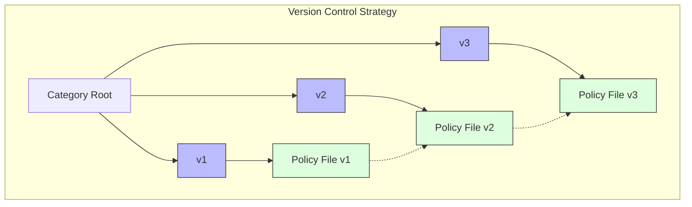
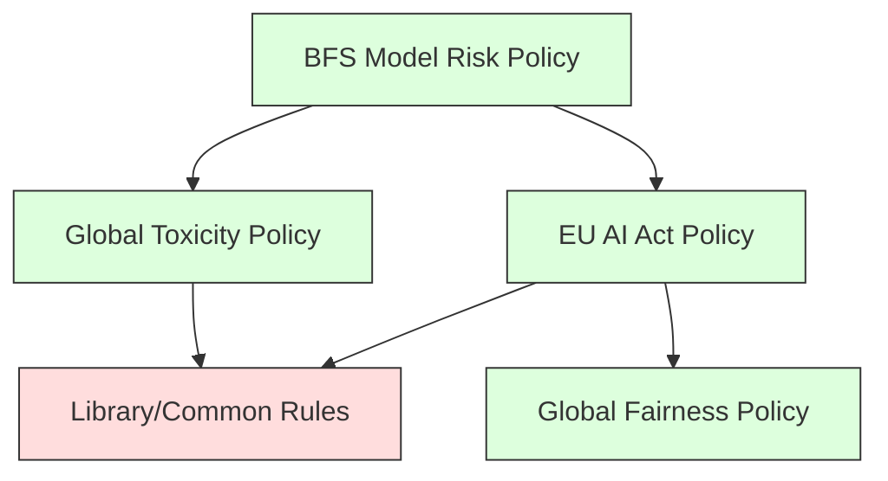
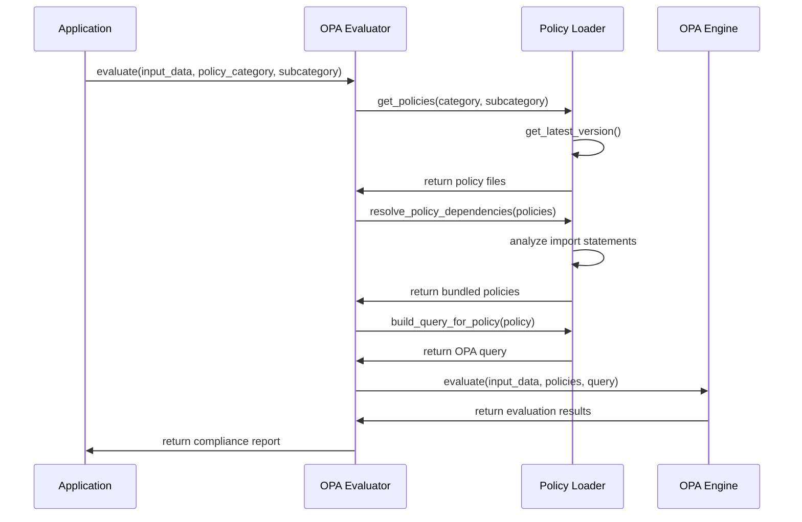
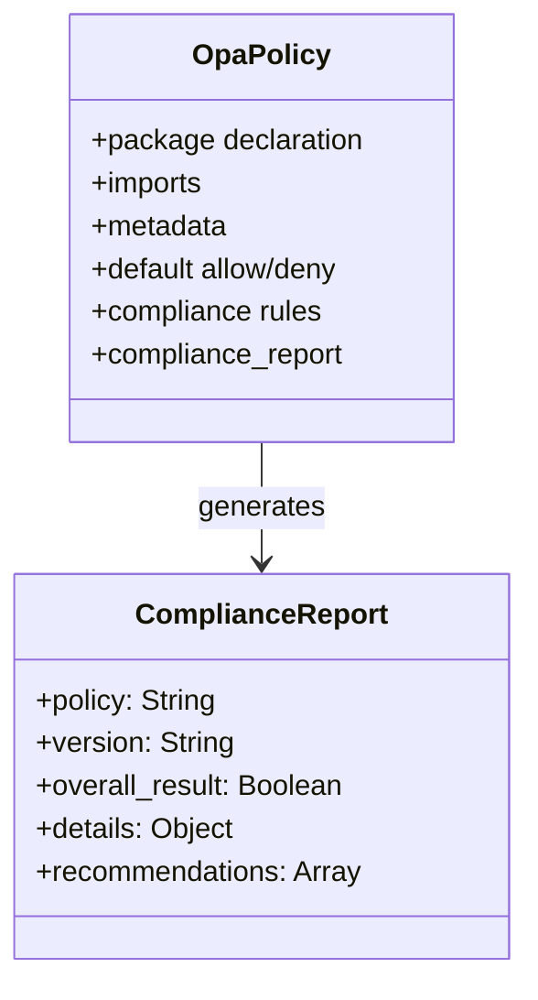

# OPA Policy Structure in AICertify

This document provides a comprehensive overview of the Open Policy Agent (OPA) policy organization within the AICertify framework. The policy architecture is designed to be modular, extensible, and version-controlled to support various AI compliance and certification needs.

## Policy Directory Structure

The OPA policies in AICertify follow a hierarchical structure organized by domains, categories, and versions. This structure enables clear organization, versioning, and dependency management.

```mermaid
graph TD
    root[opa_policies] --> global[global]
    root --> international[international]
    root --> industry_specific[industry_specific]
    root --> operational[operational]
    
    %% Global policies
    global --> global_v1[v1]
    global --> global_library[library]
    
    global_v1 --> global_toxicity[toxicity.rego]
    global_v1 --> global_fairness[fairness.rego]
    global_v1 --> global_accountability[accountability.rego]
    global_v1 --> global_transparency[transparency.rego]
    
    global_library --> common_rules[common_rules.rego]
    
    %% International policies
    international --> eu_ai_act[eu_ai_act]
    international --> india[india]
    international --> nist[nist]
    
    %% Industry-specific policies
    industry_specific --> bfs[bfs]
    industry_specific --> healthcare[healthcare]
    industry_specific --> automotive[automotive]
    
    %% Operational policies
    operational --> aiops[aiops]
    operational --> cost[cost]
    operational --> corporate[corporate]
    
    classDef category fill:#f9f,stroke:#333,stroke-width:2px
    classDef version fill:#bbf,stroke:#333,stroke-width:1px
    classDef policy fill:#dfd,stroke:#333,stroke-width:1px
    classDef subcategory fill:#ffd,stroke:#333,stroke-width:1px
    
    class global,international,industry_specific,operational category
    class global_v1 version
    class global_library,eu_ai_act,india,nist,bfs,healthcare,automotive,aiops,cost,corporate subcategory
    class global_toxicity,global_fairness,global_accountability,global_transparency,common_rules policy
```



## Policy Categories

### Global Policies
Global policies apply to all AI systems regardless of industry or jurisdiction. These fundamental policies evaluate core AI principles:
- **Toxicity**: Evaluates if AI outputs contain harmful or toxic content
- **Fairness**: Assesses bias and equity in AI systems
- **Accountability**: Ensures AI systems have proper governance and responsibility frameworks
- **Transparency**: Validates if AI systems provide adequate explanations and disclosures

### International Policies
These policies implement regulatory frameworks from different jurisdictions:
- **EU AI Act**: European Union's comprehensive framework for AI regulation
- **India**: Indian regulatory requirements for AI systems
- **NIST**: The US National Institute of Standards and Technology AI risk management framework

### Industry-Specific Policies
Tailored policies for specific industry verticals:
- **BFS**: Banking and Financial Services requirements
- **Healthcare**: Medical and healthcare-specific AI regulations
- **Automotive**: Requirements for AI in automotive applications

### Operational Policies
Policies focused on the operational aspects of AI systems:
- **AIOps**: AI operations and monitoring policies
- **Cost**: Cost efficiency and resource utilization policies
- **Corporate**: Internal corporate governance and compliance policies

## Version Control Strategy



AICertify implements versioning at the directory level:
1. Each policy category contains version directories (v1, v2, etc.)
2. The PolicyLoader automatically resolves the latest version when not specified
3. Applications can pin to specific versions for stability
4. Backward compatibility is maintained where possible

## Policy Composition and Dependencies



Policies can depend on other policies through Rego imports. The Policy Loader:
1. Resolves dependencies automatically
2. Maps package names to file paths
3. Ensures all required policies are bundled for evaluation
4. Validates import statements

## Policy Evaluation Flow



## Policy Components and Structure



Each policy file follows a standard structure:
```rego
package <category>.<subcategory>.<version>.<policy_area>

import future.keywords

# METADATA
# Title: Policy Title
# Description: Policy Description
# Version: 1.0.0
# Category: Category Name
# References:
#  - Reference 1: URL
#  - Reference 2: URL

# Default allow/deny
default allow := false

# Rules for allowing
allow if {
    # Logic for compliance
}

# Compliance report
compliance_report := {
    "policy": "Policy Name",
    "version": "1.0.0",
    "overall_result": allow,
    "details": {
        # Detailed compliance information
    },
    "recommendations": [
        # Recommendations for improving compliance
    ]
}
```

## Adding New Policies

When adding new policies:
1. Determine the appropriate category and subcategory
2. Place in the correct version directory (usually the latest)
3. Follow the naming convention and package structure of the category
4. Include proper imports for dependencies
5. Document the policy with metadata and references
6. Add tests to verify policy behavior

## External Repository Strategy

The OPA policy structure is designed to eventually support externalization to a separate repository:
1. Policies can be packaged and distributed as a separate Python package
2. Git submodules can reference external policy repositories
3. Policy loaders can fetch from remote sources
4. Version pinning ensures reproducible evaluations

## Using the PolicyLoader

The `PolicyLoader` provides programmatic access to policies:

```python
from aicertify.opa_core.policy_loader import PolicyLoader

# Initialize the loader
loader = PolicyLoader()

# Get all policies in a category (using latest version)
global_policies = loader.get_policies("global")

# Get policies in a specific category and subcategory
eu_policies = loader.get_policies("international", "eu_ai_act")

# Get policies with a specific version
v1_policies = loader.get_policies("global", version="v1")

# Resolve dependencies for composed policies
policy = loader.get_policy("global", "v1", "fairness")
all_policies = loader.resolve_policy_dependencies([policy])
```

## Best Practices

1. **Modularity**: Keep policies focused on a single concern
2. **Reusability**: Extract common logic to the library directory
3. **Testing**: Write tests for policies to verify behavior
4. **Documentation**: Include metadata and comments explaining policy logic
5. **Versioning**: Create new versions for backward-incompatible changes
6. **Dependencies**: Explicitly declare all policy dependencies 