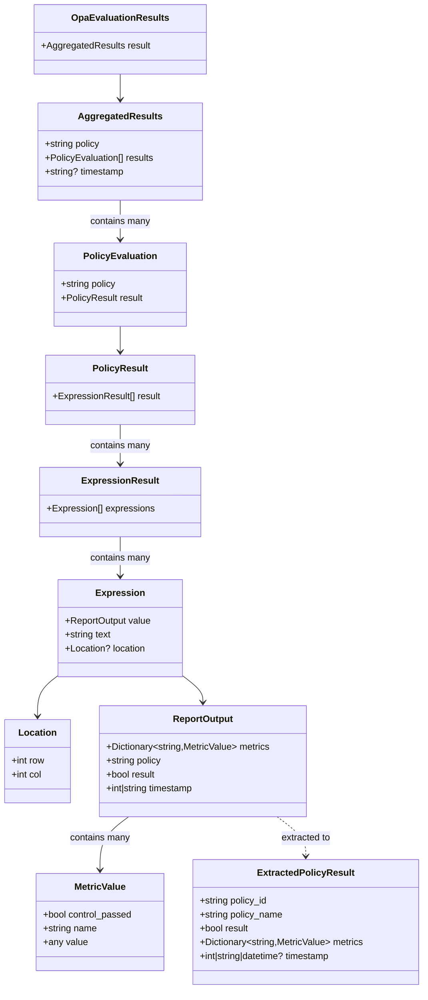

# OPA Results Schema

This document describes the schema structure for OPA evaluation results used in the AICertify system.

## Schema Structure



## Example JSON

The OPA evaluation results have a structure similar to:

```json
{
  "result": {
    "policy": "Aggregated Individual Results",
    "results": [
      {
        "policy": "international.eu_ai_act.v1.prohibited_practices.emotion_recognition",
        "result": {
          "result": [
            {
              "expressions": [
                {
                  "value": {
                    "metrics": {
                      "combined_score": {
                        "control_passed": false,
                        "name": "Combined Score Acceptable",
                        "value": false
                      },
                      "educational_context": {
                        "control_passed": false,
                        "name": "Educational Context Detection",
                        "value": true
                      },
                      "workplace_context": {
                        "control_passed": false,
                        "name": "Workplace Context Detection",
                        "value": true
                      }
                    },
                    "policy": "EU AI Act Emotion Recognition Prohibition",
                    "result": false,
                    "timestamp": 1742407145980320974
                  },
                  "text": "data.international.eu_ai_act.v1.prohibited_practices.emotion_recognition.report_output",
                  "location": {
                    "row": 1,
                    "col": 1
                  }
                }
              ]
            }
          ]
        }
      }
    ],
    "timestamp": "2025-03-19T17:59:07.731352"
  }
}
```

## Extraction Process

The extraction system uses Pydantic models to validate and parse the OPA results structure:

1. First, the entire JSON is validated against the `OpaEvaluationResults` model
2. Next, each policy evaluation is processed to extract the report output
3. Finally, the report outputs are transformed into `ExtractedPolicyResult` objects
4. These are then converted to the `PolicyResult` model used by the report generation system

## Usage

```python
from aicertify.models.opa_results import OpaEvaluationResults
from aicertify.opa_core.extraction import extract_policy_results_with_schema

# Load OPA results
with open("opa_results.json", "r") as f:
    opa_results = json.load(f)

# Extract policy results using schema validation
extracted_results = extract_policy_results_with_schema(opa_results)

# Use extracted results
for policy in extracted_results:
    print(f"Policy: {policy.policy_name}")
    print(f"Result: {policy.result}")
    print(f"Metrics: {len(policy.metrics)}")
