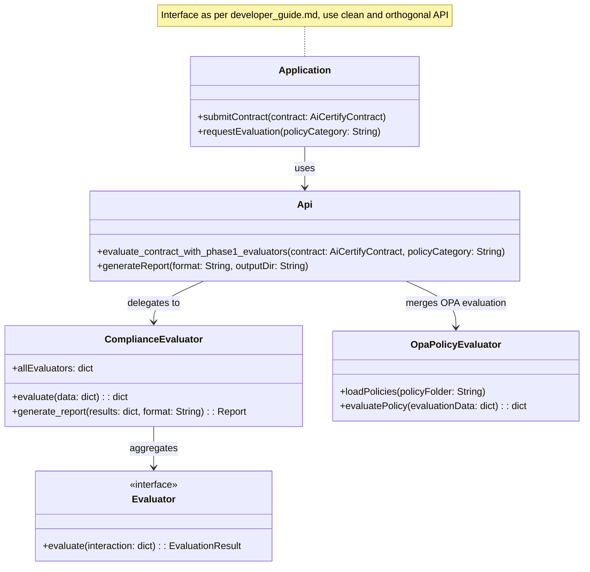

# Rego and Policy Integration Implementation Plan (EU AI Act Focus)

## Overview
This plan describes the steps to implement an end-to-end evaluation workflow that integrates rego/OPA policy evaluation for the EU AI Act. The implementation focuses on using the `eu_ai_act` folder and its child folders (instead of the `healthcare` folder) similar to the current integration in `debug_policy_evaluation.py`. A copy of the evaluation script (e.g., `debug_policy_evaluation_eu_ai_act.py`) will be created to target policies under the `eu_ai_act` tree. The goal is to assess AI systems for compliance with the EU AI Act regulations by mapping evaluator outputs against corresponding rego policies as described in `eu_ai_act_opa_policy_mapping.md` and `eu_ai_act_evaluator_integration_analysis.md`.

## Components

1. **Rego/OPA Policy Integration**
   - Use the rego policies located in the `eu_ai_act` folder and its children which map to the EU AI Act requirements.
   - Ensure policies are formatted using `opa fmt --write` and validated with `opa check`.
   - Follow a similar integration pattern as in the existing `debug_policy_evaluation.py`, but focusing on EU AI Act policies.

2. **Evaluator Integration**
   - Integrate the new evaluators (DeepEval based evaluators and HuggingFace Model Card Evaluator) with the existing ComplianceEvaluator.
   - Use these evaluators to generate measurement outputs which are then evaluated against the rego policies from the `eu_ai_act` folder.
   - Allow configuration via the parameter `use_phase1_evaluators` in the API functions to selectively enable these evaluators.

3. **PDF Report Generation**
   - Extend the report generation mechanism (in `ComplianceEvaluator.generate_report` and API functions) to support creating PDF reports.
   - The report should follow the structure and quality of the existing Medical Diagnosis report (e.g., `report_Medical Diagnosis Multi-Specialist_YYYY-MM-DD_HHMMSS.pdf`).
   - Use ReportLab for PDF generation.

4. **End-to-End Flow and Developer Interface**
   - Create a new script (e.g., `debug_policy_evaluation_eu_ai_act.py`) as a copy and modification of `debug_policy_evaluation.py` that is focused on the EU AI Act policies.
   - Update evaluation functions in `api.py` (such as `evaluate_contract_with_phase1_evaluators` and `evaluate_contract_comprehensive`) to accept a policy category parameter which can now be set to `'eu_ai_act'`.
   - Merge evaluator measurements with OPA policy evaluation results from the `eu_ai_act` folder to generate a consolidated compliance report.
   - Provide a clear, orthogonal interface between the application and the AICertify API as described in the [Developer Guide](../docs/developer_guide.md).

## UML Schematic
Below is a UML schematic (in Mermaid format) illustrating the envisioned workflow:

## Implementation Steps

### 1. Policy Integration (Rego)
- Identify the rego policy files under the `eu_ai_act` folder (e.g., `eu_ai_act/prohibited_practices`, `eu_ai_act/documentation`, etc.).
- Format and validate the policies:
  - Run: `opa fmt --write eu_ai_act/**/*.rego`
  - Run: `opa check eu_ai_act/**/*.rego`
- Update the evaluation functions to load these policies when the policy category is set to "eu_ai_act".

### 2. Modify Evaluation Functions
- In `api.py`, update the functions (e.g., `evaluate_contract_with_phase1_evaluators` and `evaluate_contract_comprehensive`) to:
  - Accept a policy category parameter, with a new option `'eu_ai_act'`.
  - When `'eu_ai_act'` is selected, load and apply the OPA policy evaluator that targets the `eu_ai_act` folder.
  - Merge the outputs from the evaluators with the OPA policy results.

### 3. Report Generation
- Enhance the report generation to support PDF using ReportLab. The report should:
  - Include an executive summary, detailed evaluator results, and OPA policy evaluation outcomes.
  - Match the style of the existing sample report (e.g., Medical Diagnosis Multi-Specialist report).
  - Save the report in the output directory with a filename pattern reflecting the EU AI Act evaluation.

### 4. End-to-End Validation
- Create and test a new script (e.g., `debug_policy_evaluation_eu_ai_act.py`) that mirrors the functionality of `debug_policy_evaluation.py`, but focuses on the `eu_ai_act` policies.
- Use a real-world sample (similar to the medical diagnosis example) to validate:
  - Correct loading of `eu_ai_act` policies.
  - Accurate merging of evaluator measurements with OPA policy results.
  - Successful generation of a consolidated report in PDF and other formats.

### 5. Developer Interface
- Ensure that the API provided in `api.py` follows a clean, orthogonal design for developers.
- Document the new methods and parameters (e.g., policyCategory = 'eu_ai_act') in the Developer Guide.
- Provide sample code snippets and examples to illustrate usage.

## Milestones and Deliverables

1. **Policy Integration Module**: Updated module that loads policies from the `eu_ai_act` folder.
2. **Updated API Functions**: Modified functions in `api.py` to handle the `'eu_ai_act'` policy category and merge OPA results.
3. **PDF Report Generation**: A robust PDF generator using ReportLab that produces reports similar to the existing sample.
4. **New Evaluation Script**: A new version of debug_policy_evaluation (e.g., debug_policy_evaluation_eu_ai_act.py) focusing on EU AI Act policies.
5. **Documentation Update**: Updated developer documentation reflecting the new interface and usage patterns.

## Additional Considerations

- **New Rego Policies for EU AI Act**:
  - We need to add any and all new rego policies required to support the EU AI Act. For rego policies that do not currently have corresponding evaluators implemented, placeholders should be added, similar to the placeholder implemented in `diagnostic_safety.rego` for healthcare. This ensures that our policy repository is complete and can be expanded as more evaluator integrations are developed.

- **Model-Card Interface and API Inputs**:
  - A clear and developer-friendly model-card interface needs to be designed to serve as input into our evaluation workflows. This interface from the application to `api.py` should allow developers to supply the necessary model metadata and evaluation parameters in a simple, intuitive manner.
  - All new inputs and configuration options provided to `api.py` should adhere to our design principles: clarity, simplicity, and consistency, to promote ease-of-use and robust adoption of our open source library.

## Conclusion
This updated integration plan shifts the focus to the `eu_ai_act` folder and its child folders, aligning the evaluation workflow with EU AI Act requirements. By creating a dedicated evaluation script and updating the API functions, while also defining placeholders for additional rego policies and a simple developer-friendly model-card interface, the solution maintains a clean separation between evaluator measurements and policy compliance logic. The final system provides a developer-friendly, orthogonal interface as outlined in the Developer Guide, and generates high-quality, consolidated compliance reports in PDF and other formats.
